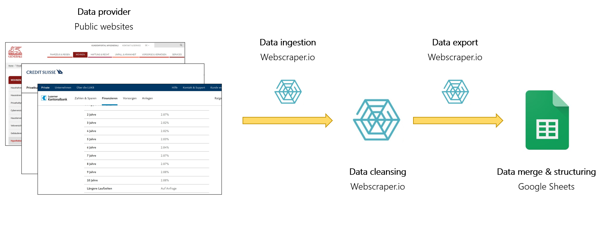
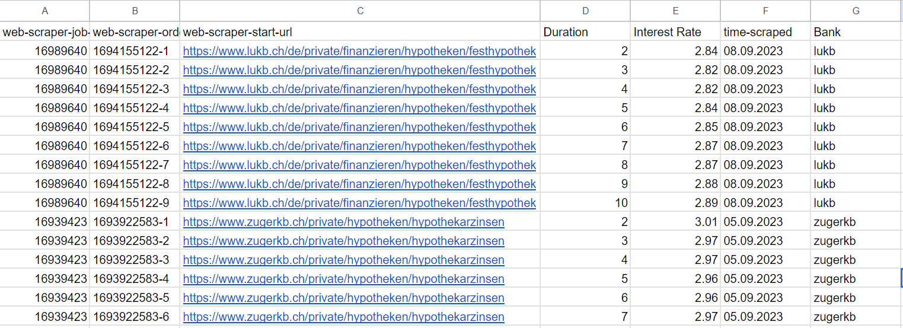
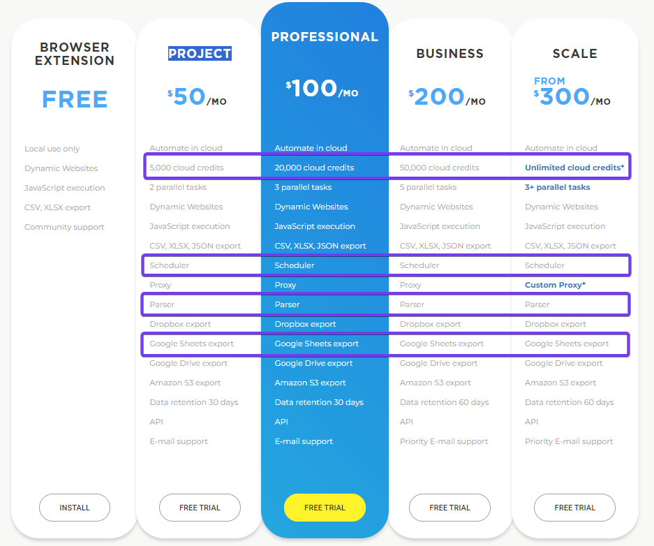
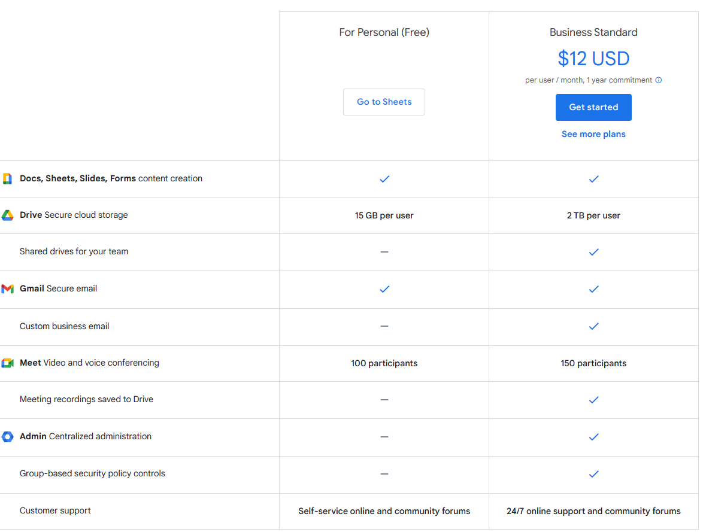

# General information about Webscraper.io
  
[WebScraper.io](https://webscraper.io/) is a browser-based tool designed for extracting data from websites with ease. It offers a user-friendly interface that allows for data collection without the need for coding. The platform can navigate and scrape multiple pages, making it useful for collecting large datasets from websites. After downloading, the data is merged and structured using [Google Sheets](https://www.google.com/sheets/about/). Google Sheets is a cloud-based spreadsheet application that is part of Google's suite of office tools. It allows users to create, edit, and collaborate on spreadsheets in real-time from any device with internet access. To clean the data and automate the process in Google Sheets we need to use some codes. The export in this use case is done with Google Sheets, as there is already a configured automatic data export from Webscraper.io.  

The figure below outlines the process for daily data download with Webscraper.io:

1. Data is sourced from various Swiss financial institutions. For this use case, we extract data from two banks and one insurance company. The process can be easily scaled to include other financial entities.
2. Data is harvested from the websites using Webscraper.io.
3. Initially, the data is saved in Webscraper.io's cloud where preliminary data cleansing occurs.
4. The data is then exported to Google Sheets. A default export channel between Webscraper.io and Google Sheets is pre-established.
5. Within Google Sheets, the data undergoes further structuring, and tables from different financial institutions are consolidated into a single table.
 
Compared to extraction via an API, webscraping provides less structured data due to varying homepage layouts and content across sites. Data cleansing and structuring become more critical and constitute a significant portion of the task with webscraping.
 

  
    

In the list below, some Swiss financial institutions are mentioned for which an attempt was made to download the interest rates using Webscraper.io. 

| Financial institution  | Website                | Webscraper.io         |
|--------------------    |---------------------   |-------------------    |
| AXA Schweiz | https://www.axa.ch/de/privatkunden/angebote/wohnen-eigentum/hypotheken.html | Webscraper.io does *not* work|
| Bank Cler | https://www.cler.ch/de/hypotheken-und-kredite/hypotheken/hypothekarzinsen| Webscraper.io does *not* work|
| Bank WIR| https://www.wir.ch/de/produkte-loesungen/geschaeftskunden/finanzieren/hypotheken/festhypotheken | Webscraper.io works |
| Credit Suisse| https://www.credit-suisse.com/ch/de/privatkunden/hypothek/services/hypothekarzinsen.html | Webscraper.io works |
| Generali Versicherung| https://www.generali.ch/privatkunden/wohnen-bauen/hypotheken | Webscraper.io works |
| Luzerner Kantonalbank| https://www.lukb.ch/de/private/finanzieren/hypotheken/festhypothek | Webscraper.io works |
| Luzerner Pensionskasse| https://www.lupk.ch/de/hypotheken-vorbezug | Webscraper.io works |
| Migros Bank| https://www.migrosbank.ch/de/privatpersonen/hypotheken-kredite/hypotheken/festhypothek.html | Webscraper.io works |
| Nidwaldern Kantonalbank| No interest rates online - only on request | Webscraper.io does *not* work |
| Obwaldner Kantonalbank| No interest rates online - only on request | Webscraper.io does *not* work |
| Pensionskasse Post| https://hypotheca.pkpost.ch/?lang=de | Webscraper.io works |
| Pensionskasse SBB| https://www.pksbb.ch/de/hypotheken/zinssaetze | Webscraper.io works |
| PostFinance| https://www.postfinance.ch/de/privat/produkte/hypotheken/zinssaetze-hypotheken.html?gad=1&gclid=CjwKCAjw3dCnBhBCEiwAVvLcu6ErynKha19h1Z-fJCizvungMx886DqeRR-rDyTyElKdvkY9LgM-MxoC-x4QAvD_BwE&gclsrc=aw.ds | Webscraper.io works |
| Raiffeisen Luzern| https://www.raiffeisen.ch/luzern/de/privatkunden/hypotheken/hypothekenzinsen.html#bankselector-focus | Webscraper.io does *not* work |
| Swiss Life| https://www.swisslife.ch/de/private/produkte/hypotheken/aktuelle-zinssaetze.html | Webscraper.io works |

| Swiss Life| https://www.swisslife.ch/de/private/produkte/hypotheken/aktuelle-zinssaetze.html | Webscraper.io works |
| Swiss Life| https://www.swisslife.ch/de/private/produkte/hypotheken/aktuelle-zinssaetze.html | Webscraper.io works |
| Swiss Life| https://www.swisslife.ch/de/private/produkte/hypotheken/aktuelle-zinssaetze.html | Webscraper.io works |
| Swiss Life| https://www.swisslife.ch/de/private/produkte/hypotheken/aktuelle-zinssaetze.html | Webscraper.io works |

  
For a few websites, this did not work as they use a webscraper blocker. It is possible that using other webscraping tools, data from these websites can still be downloaded.

    

## Result
 
The final result is a list of interest rates over various terms from different financial institutions. The file is updated daily.
  

    

## Running costs
 

| Application  | Free Version  | Note          |
|-----------    |---------------|---------------|
| Webscraper.io | (yes)         | A free version is available, but it doesn't offer all the services (cloud, parser, etc.) necessary for this setup. The "Project" subscription is sufficient for accessing around 170 websites per month. The costs are USD 50. |
| Google Sheets | yes         | As long as no more than 15 GB of storage space is required, the free version suffices. |

    

Here the detailed costs of Webscraper.io: [Pricing](https://webscraper.io/pricing). 
 

 
A page/cloud credit corresponds to a single page load in the Web Scraper Cloud. If the scraper navigates through 100 pages, it will consume 100 page credits. Extracting 100 records from just one page will only deduct one page credit.
    
Here the detailed costs of Google Sheets: [Pricing](https://www.google.com/sheets/about/#pricing).  
 

