# Setup

<br><br>

In this document, we will demonstrate how to set up the respective tools. This includes the following:

1. Webscraper.io
2. Webscraper.io - Cloud
3. Google Sheets
4. Interface Webscraper.io with Google Sheets
5. Consolidated file containing data from various financial institutions via Google Sheets 

<br><br><br>

How to perform website extraction will be illustrated using the following three web pages. Interest rates will be extracted from all of these pages:

- [Luzerner Kantonalbank](1Webscraper.io_LuzernerKantonalbank.md)
- [Credit Suisse](1Webscraper.io_CreditSuisse.md)
- [Generali Insurance](1Webscraper.io_Generali.md)

<br><br>
Follow this guide to get started.

<br><br><br><br>

### 1 Webscraper.io
<br><br>
It is recommended to use the Google Chrome browsen. This browser has a wide user base, is regularly updated, and tends to be compatible with a variety of web technologies, which makes it a suitable choice for web scraping tools like Webscraper.io. 
<br><br>
Go no to the website of [Webscraper.io](https://webscraper.io/) and click on **Install**.
<br><br>


<br><br><br><br>

**Add to Chrome**.
<br><br>


<br><br><br><br>

You have now installed the tool. Now take a look at the [tutorials](https://www.webscraper.io/web-scraper-first-time-install) on how to do the setup in Google Chrome.
<br><br>


Once you have done this, you have completed the local setup. 
<br><br><br><br>
### 2. Webscraper.io - Cloud
<br><br>
In order to retrieve the data on a daily basis, the cloud version is required. To do this, go back to the [Webscraper.io](https://webscraper.io/) homepage. Click this time on **Cloud Login**.
<br><br>


<br><br><br><br>

Create a new web scraper account. The login process should be self-explanatory.
<br><br>


<br><br><br><br>

Webscraper.io - Cloud has several functionalities. The most important ones are described here:
<br>
- Import Sitemaps (create new sitemaps)
- My Sitemap ( shows all created sitemaps)
- Jobs ( shows all files created by scraping)
- Data Export (this function loads the data into Google Sheets)
- Subscription Manager (needed to request the appropriate subscription)
<br><br>


<br><br><br><br>

In order to use the relevant functions in the cloud application, you need a paid account. Go to **Subscription Manager** and create a **Project account**. This costs USD 50 per month. You can find out more about pricing [here](0Webscraper.io_General-Information.md).
<br><br>


<br><br><br><br>

We have now installed webscraper both locally and in the cloud. 
<br><br>
Now we need to download the content from the respective websites. In this repository there is a description of how this can be implemented for the following websites:
<br><br>
- [Luzerner Kantonalbank](1Webscraper.io_LuzernerKantonalbank.md)
- [Credit Suisse](1Webscraper.io_CreditSuisse.md)
- [Generali Insurance](1Webscraper.io_Generali.md)
<br>

Click on the corresponding websites and do the setup. You can also extend your data collection to other websites. The process is always the same. Depending on how the data is prepared on the website, there are slight adjustments. 
<br><br>
A list of financial institutions for which Webscraper.io works can be found under [Webscraper.io_General-Information](0Webscraper.io_General-Information.md).
<br><br>
When you have done the setup in Webscraper.io according to the descriptions for the configuration of the respective websites, you can continue with the process below.

<br><br><br><br>

### 3. Google Sheets
<br><br>
The export in this use case is done with Google Sheets, as there is already a configured automatic data export from Webscraper.io.
<br><br>
In case you have already an gmail account - you have also an account with Google Sheets. Otherwise sign up and request an user account. Click [here](https://www.google.com/intl/en/sheets/about/) and **Sign up for free**. The login process should be self-explanatory.
<br><br>
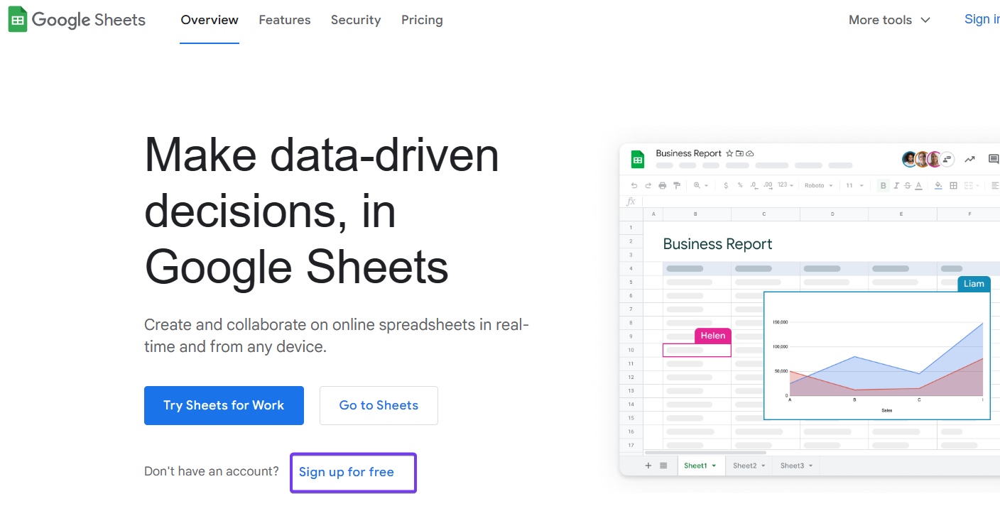

<br><br><br><br>

### 4. Interface Webscraper.io with Google Sheets
<br><br>
Before you proceed with this step, please make sure that you have an account with Webscraper.io and Google Sheets.
<br><br>
Go no to the website of [Webscraper.io](https://cloud.webscraper.io/data-export), go to **Data Export** and click on **Google**. The rest of the login process should be self-explanatory.
<br><br>
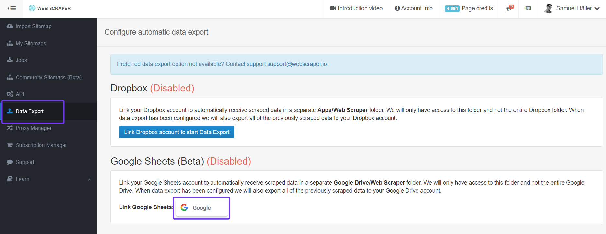
<br><br>
On this page, you can also see which other application already have a standardized interface with Webscraper.io.

<br><br><br><br>

When you have done the registratio with Google Sheets make sure to select **Keep one file per sitemap, each scraping job will append data to the end of a sheet**.

**Save** selection. This selection takes care that nothing will be overwriten.
<br><br>
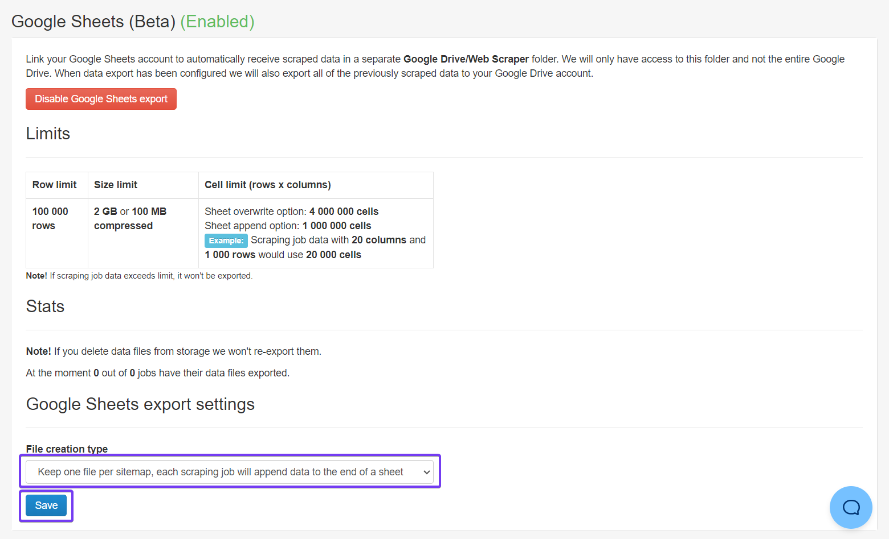

<br><br><br><br>

To trigger an upload to your Google Sheets account go in Webscraper.io to **My Siteaps**. Select all your sitemaps one by one - in this example **0Generali** - and **Scrape** each sitemap.
<br><br>
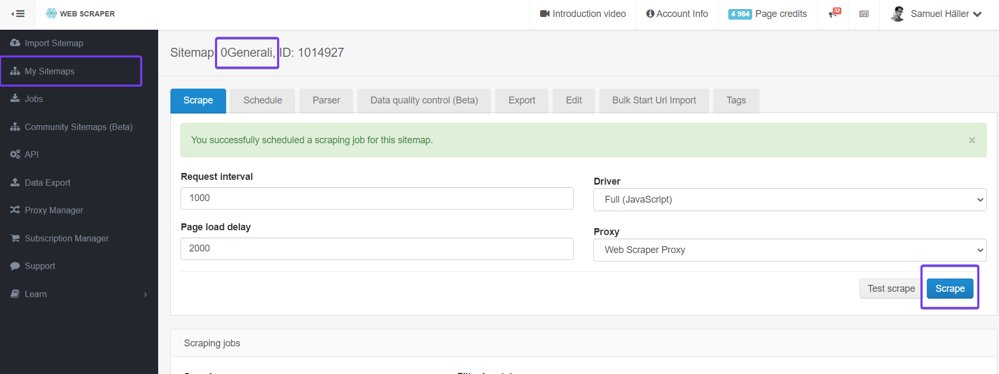

<br><br><br><br>

Open now your [Spreadsheets](https://docs.google.com/spreadsheets/) in your Google Sheets account. There you will now see all triggered sitemaps. 
<br><br>
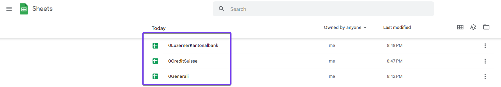
<br><br>
Each time a new scraping is executed, the dataset is added to the respective file.
<br><br><br>
How to edit the individual files is described in the respective website documentation:
- [Luzerner Kantonalbank](1Webscraper.io_LuzernerKantonalbank.md)
- [Credit Suisse](1Webscraper.io_CreditSuisse.md)  --> Good example when several adjustments have to be made in Google Sheets for structuring the data
- [Generali Insurance](1Webscraper.io_Generali.md)

<br><br><br><br>

### 5. Consolidated file containing data from various financial institutions via Google Sheets
<br><br>
When all files have been customised and have the same structure, all files can be merged into one. This makes it easier to analyse and process the data in a next step. 
<br><br>
Open your [Spreadsheets](https://docs.google.com/spreadsheets/) in your Google Sheets account - on the bottom right of the page there is a + symbol. Click on it **Create new spreadsheet**.  
1. Name your spreadsheet. In this example ```0InterestRates_all```
2. Go to **Extensions**
3. **Apps Script**
<br><br>
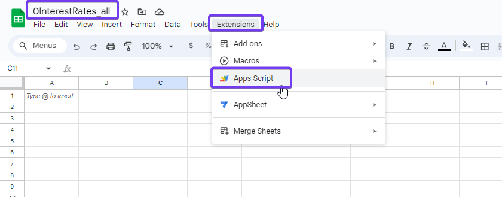

<br><br><br><br>

We will now enter a code that copies the contents of each of the files we have from our financial institutions into our worksheet.
<br><br>
Delete the existing code and enter the following one in the *Apps Script* console. 
<br><br>
```
function copyDataFromOtherSheets() {
  // Set the Spreadsheet IDs and table names
  var sheet1Id = "1wSnOpdCijkT6bMYbg3m9dUgrHOOlw9bBttN5dMYYoz0"; // Adjust according to your settings
  var sheet1Name = "0LuzernerKantonalbank"; // Adjust according to your settings

  var sheet2Id = "1wLA7_PcsSEVgx3rKywJtTWv6ZqKUbCYEJLhch0sQ604"; // Adjust according to your settings
  var sheet2Name = "0Generali"; // Adjust according to your settings

  var sheet3Id = "129iS287XRyx0rS9TtdVQia-uk0KOHPgPE8uviReNv-Q"; // Adjust according to your settings
  var sheet3Name = "CS_adj"; // Adjust according to your settings                                    

  // Open the tables and fetch the data
  var sheet1Data = SpreadsheetApp.openById(sheet1Id).getSheetByName(sheet1Name).getDataRange().getValues();
  var sheet2Data = SpreadsheetApp.openById(sheet2Id).getSheetByName(sheet2Name).getDataRange().getValues();
  var sheet3Data = SpreadsheetApp.openById(sheet3Id).getSheetByName(sheet3Name).getDataRange().getValues();

  // Get the current worksheet
  var currentSheet = SpreadsheetApp.getActiveSpreadsheet().getActiveSheet();

  // Check if the header has already been written. If not, leave the first row free.
  if (currentSheet.getRange(1, 1).getValue() === '') {
    var totalRows = sheet1Data.length + sheet2Data.length + sheet3Data.length - 3; // -3 because the headers of the other sheets are ignored
    currentSheet.insertRows(2, totalRows);
  }

  // Add data from the first table (excluding the header)
  currentSheet.getRange(2, 1, sheet1Data.length - 1, sheet1Data[0].length).setValues(sheet1Data.slice(1));

  // Add data from the second table (excluding the header)
  currentSheet.getRange(sheet1Data.length + 1, 1, sheet2Data.length - 1, sheet2Data[0].length).setValues(sheet2Data.slice(1));

  // Add data from the third table (excluding the header)
  currentSheet.getRange(sheet1Data.length + sheet2Data.length + 1, 1, sheet3Data.length - 1, sheet3Data[0].length).setValues(sheet3Data.slice(1));
}
```
<br><br>
Click on **Save** but **don't** *Run* the script yet. First we have to adjust the references to your spreadsheets. See line 3,4,6,7,9 and 10. 
<br><br>
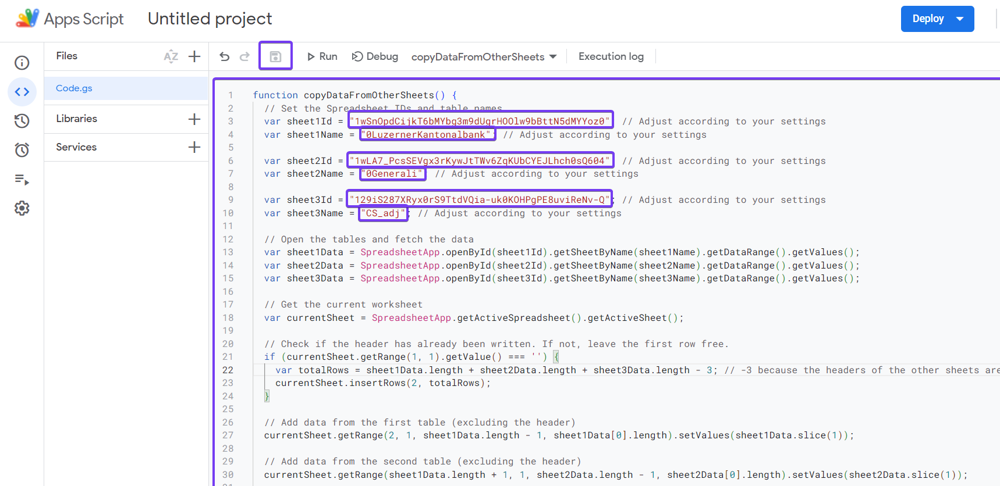

<br><br><br><br>

To retrieve the *sheet1Id* of the respective spreadsheets, open a new window tab and access a spreadsheet from which you want to consolidate data. In this example, I've taken the spreadsheet from **0LuzernerKantonalbank**.
<br><br>
Copy the link: *https://docs.google.com/spreadsheets/d/1wSnOpdCijkT6bMYbg3m9dUgrHOOlw9bBttN5dMYYoz0/edit#gid=0* --> The ID is the lengthy code situated between the two slashes (**/**). 
In this example: 1wSnOpdCijkT6bMYbg3m9dUgrHOOlw9bBttN5dMYYoz0
<br><br>
Now, retrieve this code for all the spreadsheets you wish to consolidate in the master file **0InterestRates_all**.
<br><br>
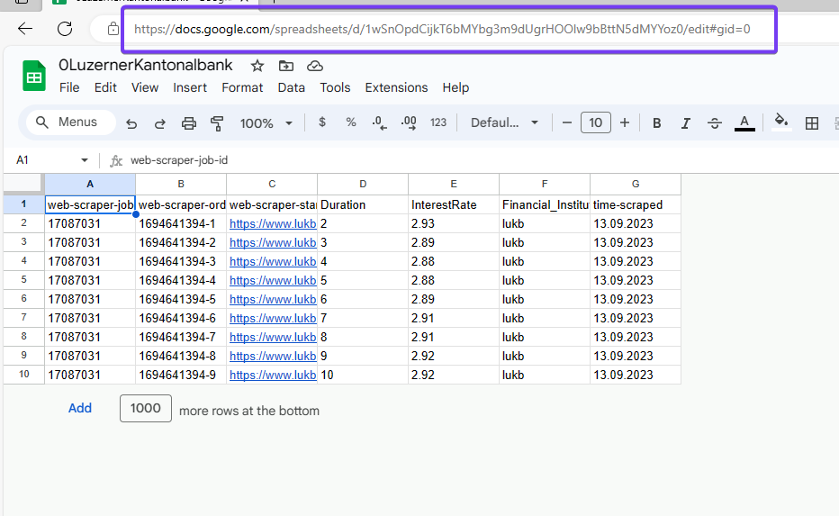

<br><br><br><br>

Now switch back to the tab and navigate to the *Apps Script* of your master file **0InterestRates_all**.
<br><br>
Replace in your code all the *sheetIds*. In addition, you'll need to specify the name of the worksheet in *sheetName*. Often, the worksheet name is the same as the name of the spreadsheet. However, in the case of the file **0CreditSuisse**, for example, it isn't.
<br><br>
In this example we consolidate three different spreadsheets. In case you have more sheets you can extend the code with the applied logic.
<br><br>
Whe you have finalised the code - **save** it and click **Run**.
<br><br>


<br><br><br><br>

If this is the first code you're implementing in *Apps Scripts* for this spreadsheet, you'll need to grant the application the necessary permissions before executing the code. Click on **Review permissions**.
<br><br>
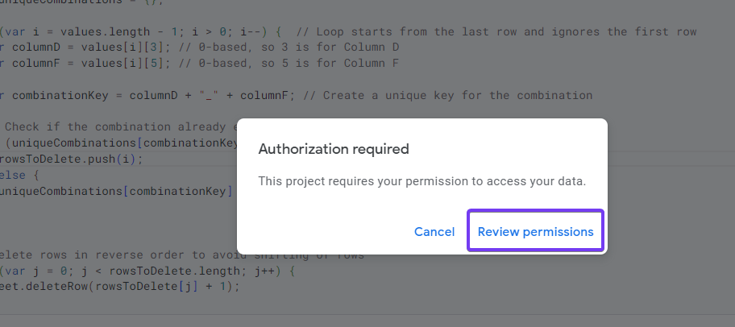

<br><br><br><br>

Select your Google account.
<br><br>
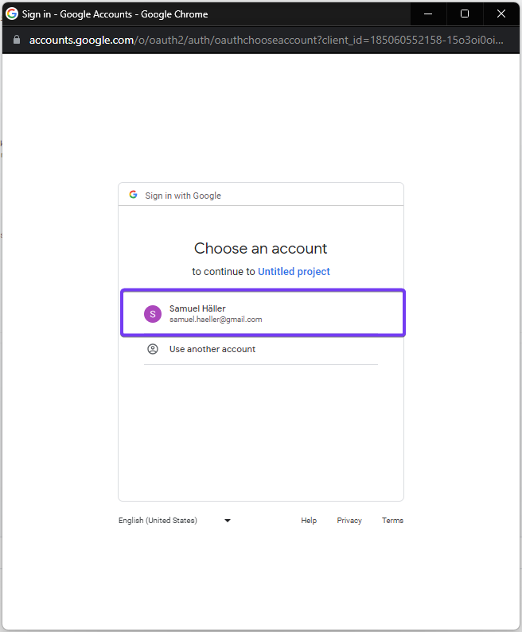

<br><br><br><br>

1. Click **Advanced**
2. Click **Go to Untitled project (unsafe)**. If you have named your code in *App Script*, it can be named differently.
<br><br>
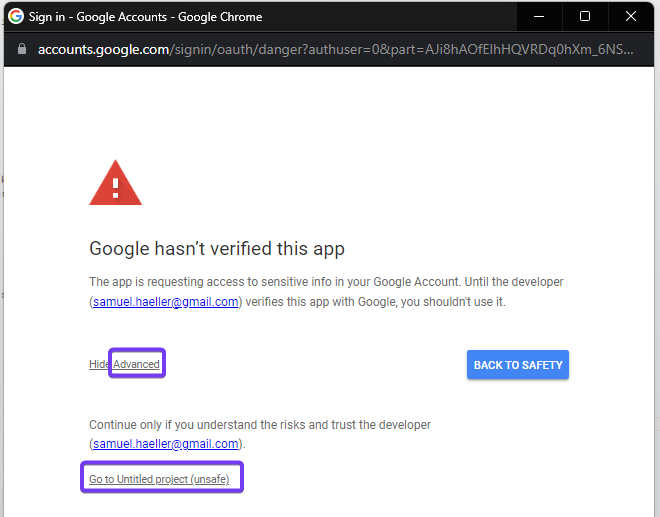

<br><br><br><br>

**Allow**
<br><br>
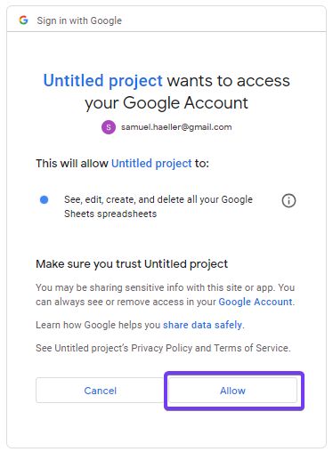

<br><br><br><br>

The code is now executed. 
<br><br>
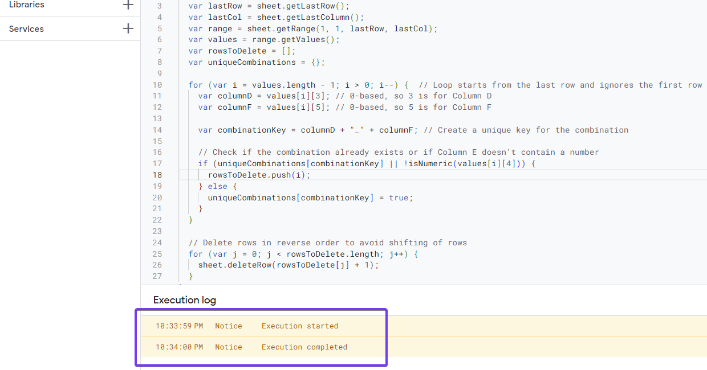

<br><br><br><br>

Go now back to the **0InterestRates_all** spreadsheet and review the data. The script seems to work, all data is consolidated. 
<br><br>
On the first line the header is missing. If this is requested, the header must be entered manually once. 
<br><br>
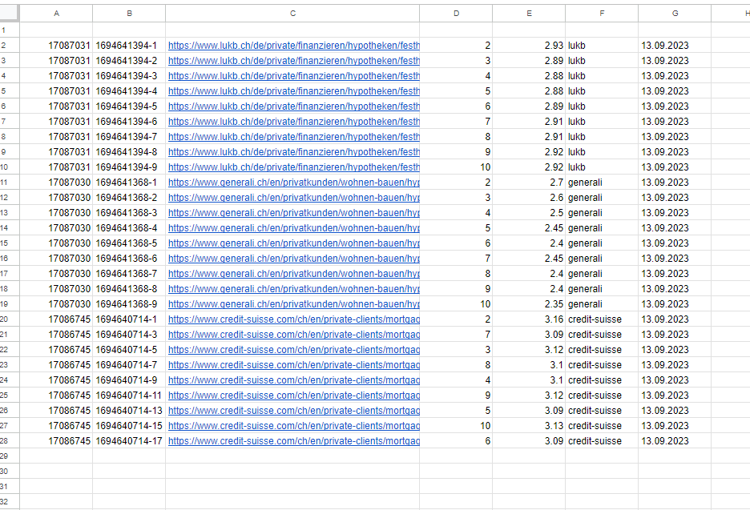

<br><br><br><br>

Now we want this code to be executed on a daily basis. Go back to the *Apps Script* application.
1. Go to **Extensions**
2. Select **Apps Script**
3. In the Apps Script application, click on the clock icon (*Triggers*) on the left side
4. **Add Trigger**
<br><br>
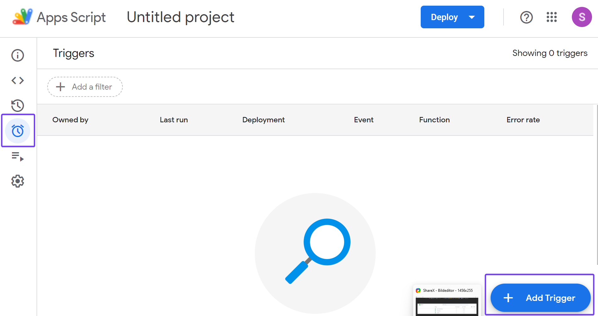

<br><br><br><br>

Now we specify the trigger.
1. Select event source: **Time-driven**
2. Select type of time based trigger: **Day timer**
3. Select time of the day: **6am to 7am** (make sure that this time is a few minutes after the scraping in Webscraper.io is executed)
4. Rest stays the same
5. **Save**
<br><br>
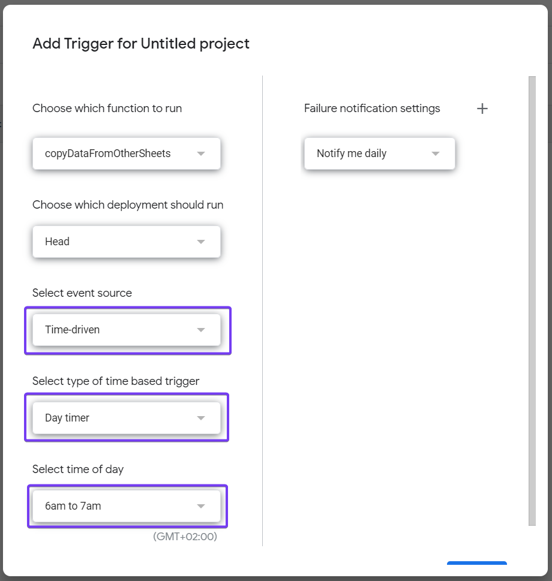
<br><br>
With this setting, you receive a notification when an error occurs.

<br><br><br><br>

With that, we've reached the end of the process. As a result, you have a master file in which you have the interest rates from all desired financial institutions on a daily basis. This file is updated once a day.


<br><br><br><br>


