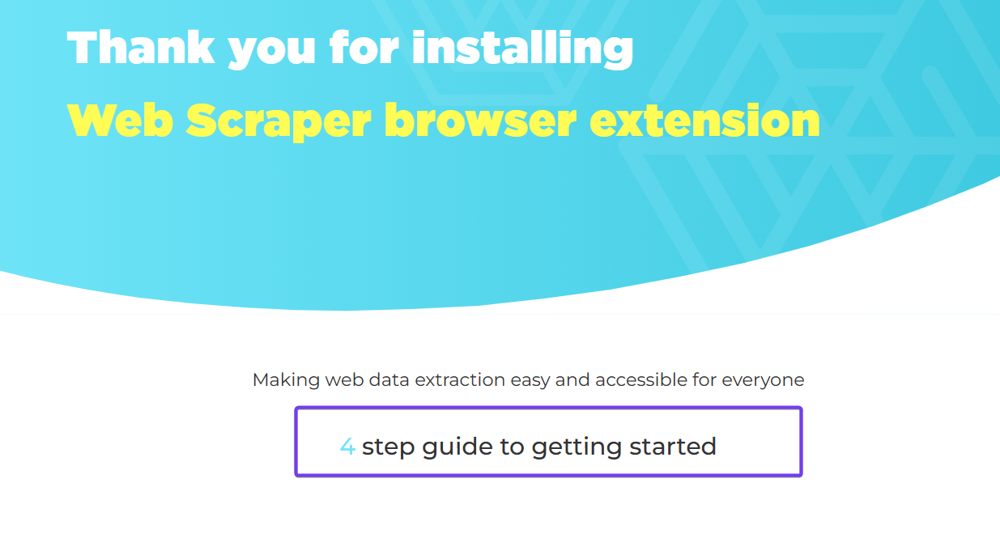
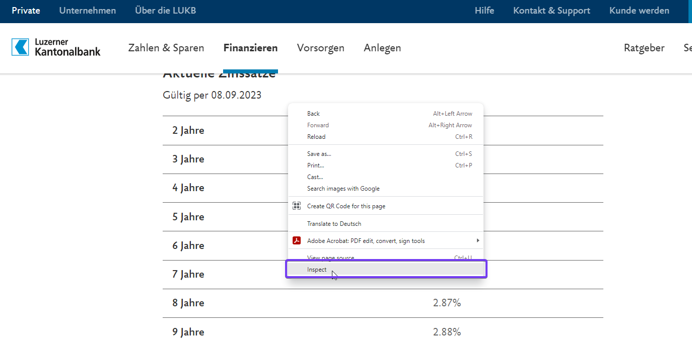
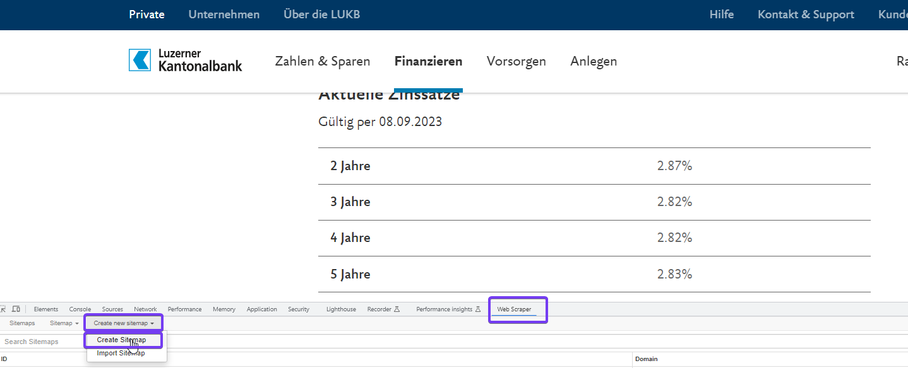
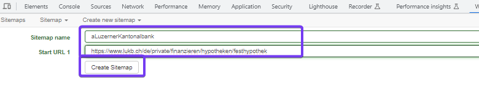
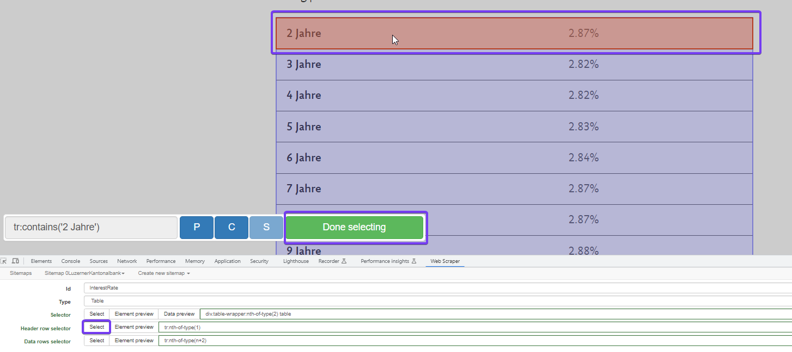
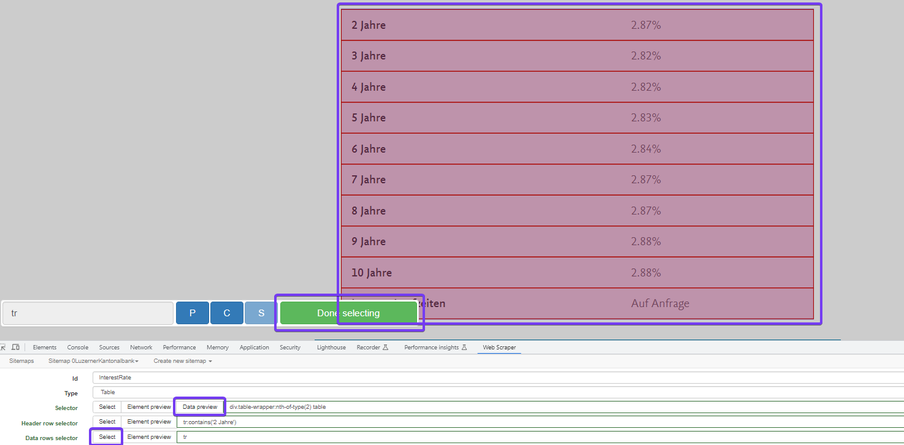
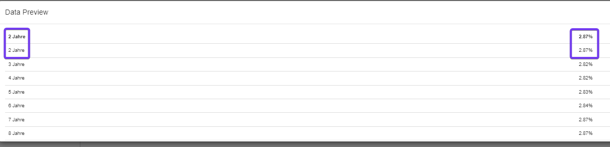
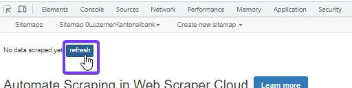

# Setup

<br><br>

### Webscraper.io
<br><br>
It is recommended to use the Google Chrome browsen. This browser has a wide user base, is regularly updated, and tends to be compatible with a variety of web technologies, which makes it a suitable choice for web scraping tools like Webscraper.io. 
<br>
Go no to the website of [Webscraper.io](https://webscraper.io/) and click on **Install**.
<br><br>


<br><br><br><br>

**Add to Chrome**.
<br><br>


<br><br><br><br>

You have now installed the tool. Now take a look at the [tutorials](https://www.webscraper.io/web-scraper-first-time-install) on how to do the setup in Google Chrome.
<br><br>



### Luzerner Kantonalbank
<br><br>
The installation and setup is now done. We are now starting with our first website. 
<br>
The Luzerner Kantonalbank is the first bank from which we download the interest. Go to this [website](https://www.lukb.ch/de/private/finanzieren/hypotheken/festhypothek). 
1. Scroll down where the interest rates are shown.
2. Left click and select "inspect".
<br><br>


<br><br><br><br>

1. Select the section **Web Scraper**.
2. **Create new sitemap**
3. **Create Sitemap**
<br><br>


<br><br><br><br>

1. Name the Sitemap - in this example its called ```0LuzernerKantonalbank```.
2. Enter the website ```https://www.lukb.ch/de/private/finanzieren/hypotheken/festhypothek```.
3. **Create Sitemap**
<br><br>


<br><br><br><br>

1. **Add new selector**
2. Name the selector - in this exampled ```InterestRate```
3. Select as a Type **Table**
4. Click in the line Selector on **Select**
5. Now you can mark the whole table with the interest.
6. **Done selecting**
7. 
<br><br>


<br><br><br><br>

1. Now you have to select the header. Click on **Select**.
2. Since there is now header in the table - select the first line.
3. **Done selecting**
<br><br>


<br><br><br><br>

1. With the data rows selector you now select the data. Click on **Select**.
2. Mark the whole table - incuding the first line (header line).
3. **Done selecting**
4. To review our setup click now on **Data preview**.
<br><br>


<br><br><br><br>

The preview should now include the years and interest rates as in the figure below. Please check if the first line of the table is entered twice - once as a header and once as a data row. If this is not the case, please reselect the table, header and data again till it all data is included correctly. 
<br>
If everything looks okay, you can close the preview view again. 
<br><br>


<br><br><br><br>

1. Tick the box **Multiple**
2. Name the columns ```Duration``` and ```InterestRate```
3. Tick both boxes **Include into result**
4. Go on **Data preview** again and check, if now the header has changed according your adjustments.
5. **Safe selector**
<br><br>


<br><br><br><br>

Now we execute the webscraping.
1. Click on **Sitemap** ***0LuzernerKantonalbank***
2. Select **Scrape**
<br><br>


<br><br><br><br>

You are now asked about the request interval and page load delay. 

- Request interval: Determines the amount of time the scraper waits between sending requests to web pages.
- Page load delay: Specifies the duration the scraper waits for a page to fully load before extracting the data.
<br>
It's done to mimic human browsing behavior, avoid overloading the server, and reduce the chances of getting banned or blocked due to rapid or frequent requests. For the time being, we leave the default settings at 2000 miliseconds. Therefore, just click **Start scraping**.
<br><br>


<br><br><br><br>

A window now opens and closes itself again after a few seconds. After that click on **refresh**.
<br><br>


<br><br><br><br>

You will now see the data that has been downloaded. Make sure that they are complete and that each column contains data.
<br><br>


