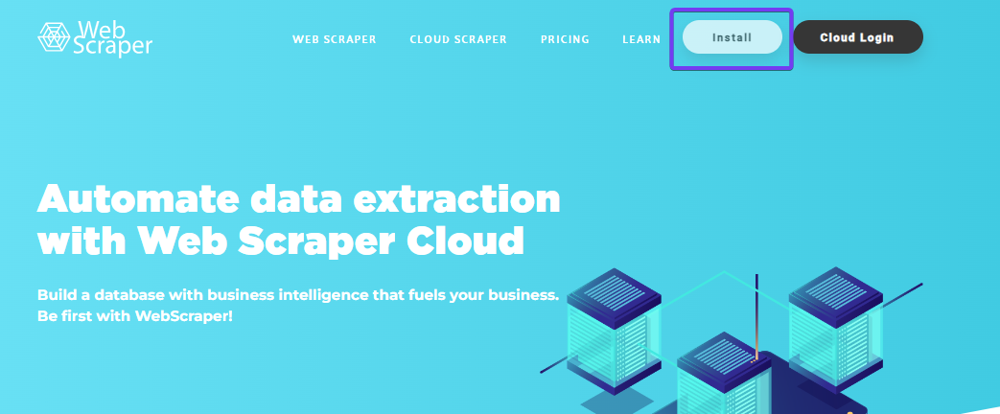

# Setup

  

### Webscraper.io
  
It is recommended to use the Google Chrome browsen. This browser has a wide user base, is regularly updated, and tends to be compatible with a variety of web technologies, which makes it a suitable choice for web scraping tools like Webscraper.io. 
 
Go no to the website of [Webscraper.io](https://webscraper.io/) and click on **Install**.
  

    

**Add to Chrome**.
  

    

You have now installed the tool. Now take a look at the [tutorials](https://www.webscraper.io/web-scraper-first-time-install) on how to do the setup in Google Chrome.
  

Once you have done this, you have completed the local setup. 
    
### Webscraper.io - Cloud
  
In order to retrieve the data on a daily basis, the cloud version is required. To do this, go back to the [Webscraper.io](https://webscraper.io/) homepage. Click this time on **Cloud Login**.
  

    

Create a new web scraper account. The login process should be self-explanatory.
  

    

Webscraper.io - Cloud has several functionalities. The most important ones are described here:
 
- Import Sitemaps (create new sitemaps).
- My Sitemaps ( shows all created sitemaps)
- Jobs ( shows all files created by scraping)
- Data Export (this function loads the data into Google Sheets)
- Subscription Manager (needed to request the appropriate subscription)
  

    

In order to use the relevant functions in the cloud application, you need a paid account. Go to **Subscription Manager** and create a **Project account**. This costs USD 50 per month. You can find out more about pricing [here](0Webscraper.io_General-Information.md).
  

    

We have now installed webscraper both locally and in the cloud. 
 
Now we need to download the content from the relevant websites. In this repository, this is shown by the following websites.
 
- [Luzerner Kantonalbank](1Webscraper.io_LuzernerKantonalbank.md)
- [Credit Suisse](1Webscraper.io_CreditSuisse.md)
- [Generali Versicherung](1Webscraper.io_Generali.md)
 

Click on the corresponding websites and do the setup. You can also extend your data collection to other websites. The process is always the same. Depending on how the data is prepared on the website, there are slight adjustments. 
 

When you have done the setup according to the descriptions for the configuration of the respective websites, you can continue with the process below.

