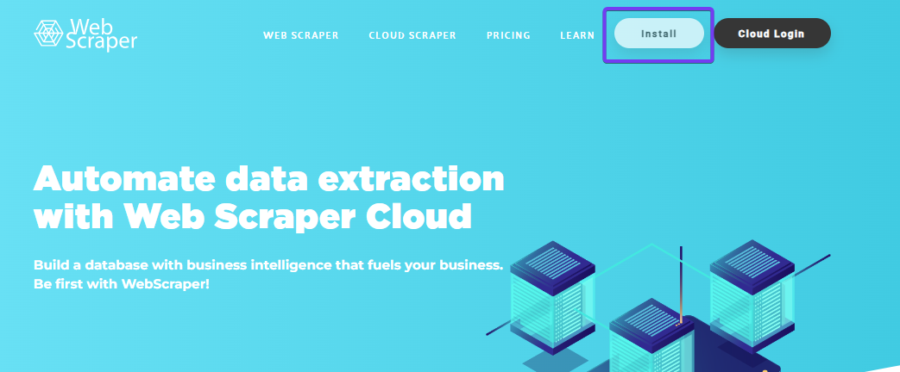
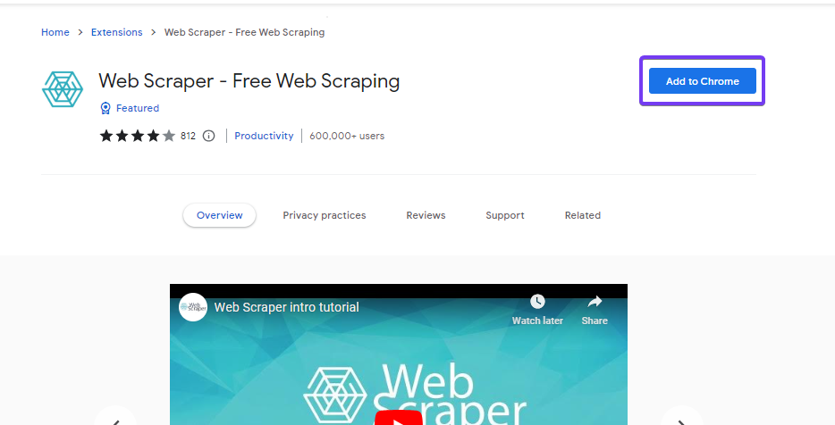
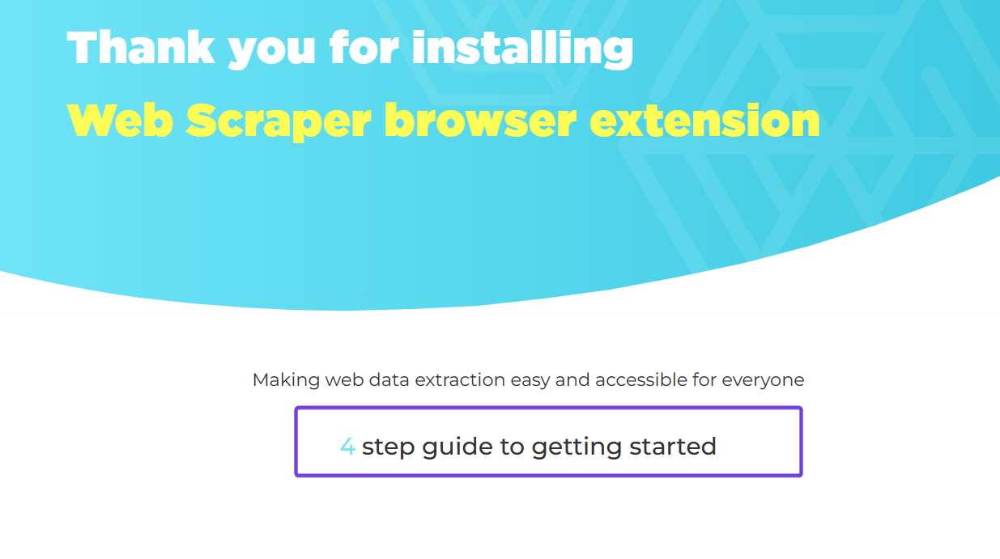

# Setup

<br><br>

### Webscraper.io
<br><br>
It is recommended to use the Google Chrome browsen. This browser has a wide user base, is regularly updated, and tends to be compatible with a variety of web technologies, which makes it a suitable choice for web scraping tools like Webscraper.io. 
<br>
Go no to the website of [Webscraper.io](https://webscraper.io/) and click on **Install**.
<br><br>


<br><br><br><br>

**Add to Chrome**.
<br><br>


<br><br><br><br>

You have now installed the tool. Now take a look at the [tutorials](https://www.webscraper.io/web-scraper-first-time-install) on how to do the setup in Google Chrome.
<br><br>



When a new base is opened, Airtable creates an Excel-like interface with a table. You can now give your base a name. In this example I have given the name **StockMarketData**. In the first column of the table, the symbols of the respective shares of which you want to build a history can be entered. How to determine the symbols of the respective shares is described under [Alpha-Vantage_Stock Selection](../00-Alpha_Vantage/Alpha-Vantage_Stock-Selection.md).
<br><br>


<br><br><br><br>

In order to download the data from Alpha Vantage, the add-on application Data Fetcher is required in Airtable. This tool can be added via **extensions**.
<br><br>


<br><br><br><br>

Search for the tool **Data Fetcher** and add the application.
<br><br>


<br><br><br><br>

Register with the Data Fetcher application. There is a basic version which is free of charge. 
<br><br>


<br><br><br><br>

Start your first request with Data Fetcher.
<br><br>


<br><br><br><br>

1. Name the process
2. Select **Custom**
3. Enter the following Link
   ```
   https://www.alphavantage.co/query?function=SYMBOL_SEARCH&keywords=EMMI&apikey=demo
   ```
4. Replace **demo** with your personal API key. How to get an API Key is explained [here](../00-Alpha_Vantage/Alpha-Vantage_General-Information.md).
5. Click on the **+** sign next to IBM. 
<br><br>


<br><br><br><br>

1. Select the table where you have entered your stock symbols. If you didn't change the name manually the table is called **Table 1**.
2. Select the column/field name where you have entered the symbols of your shares. If you didn't change the field manually its called **Name**.
3. Confirm selections.
<br><br>


<br><br><br><br>

Set up the scheduled request. The data should be requested every day in the morning at 0900am. In other words, the table with the data is updated each morning.    
<br><br>


<br><br><br><br>

Each listed stock symbol generates one **run** daily. However, only 100 runs are included in the free basic version. It is therefore very quickly necessary to upgrade. This can be done directly at Data Fetcher under [Pricing](https://datafetcher.com/). The costs for the respective versions are as shown in the figure below. 
<br><br>


<br><br><br><br>

1. After setting up the schedule request - click on **run**
2. New Windows opens - click on **continue**
<br><br>


<br><br><br><br>

1. New Windows opens - click on **Filter all**.
2. Select all fields/columns with the information you want to have about the shares.
   In this example the following fields have been selected:
   * Global Quote symbol
   * Global Quote price
   * Global Quote volume
   * Global Quote latest trading day 
3. Click on **Save & run**
<br><br>


<br><br><br><br>

New window opens - click on **Show output table**   
<br><br>


<br><br><br><br>

We are now back in the original mask of our **base**. The table has now been completed with the new columns accoring to our request. 
1. Delete the columns that we no longer need.
2. Add a new column **Last modified time** 
<br><br>


<br><br><br><br>

Choose an name for the new column and select **All editable fields**. Then click on **Create field**.
<br><br>


<br><br><br><br>

The table should now look like the illustration below.
<br><br>


<br><br><br><br>

Now add a new table and give it a name. Save it.
<br><br>


<br><br><br><br>

Adjust the column names as they appear in Table 1. Also adjust the format in the respective columns (e.g. word or number).
<br><br>


<br><br><br><br>

### Zapier
<br><br>
In order to be able to add the data from table 1 to our new table, we need the application Zapier. As soon as the data in the first table is updated, this data is added to the second table. The existing data is not overwritten but added. In this way, we build up a database of the respective shares.

Register yourself at [Zapier](https://zapier.com/app/login). Enter your personal details.
<br><br>


<br><br><br><br>

In the registration process you will be asked for which applications you use Zapier. Select **Airtable**.
<br><br>


<br><br><br><br>

After the registration is completed you will be able to **create Zap**. Click on the button.
<br><br>


<br><br><br><br>

A new page opens with an illustration of the process flow. Click on **1. Untitled Step**.
<br><br>


<br><br><br><br>

In the new window that opens, select the **Airtable** option.
<br><br>


<br><br><br><br>

A new selection bar opens on the right-hand side. Select **New or Updated Record** as the event. **Continue**.
<br><br>


<br><br><br><br>

You will now be asked to link your Airtable profile to Zapier. Link the accounts and **Grant access**. 
<br><br>


<br><br><br><br>

After connection your accounts click on **contine**. 
<br><br>


<br><br><br><br>

Under the section **Trigger** select the respective options - see figure below. 
In Table 1 in Airtable, the **Last modified time** column is always updated as soon as the data is reloaded. This is the trigger when Zapier is to copy the data into the second table. This process ensures that no data is loaded twice into the second table.
<br><br>


<br><br><br><br>

Test the setup. If everything is set correctly, a record should appear. **Continue with selected record**.
<br><br>


<br><br><br><br>

The representation of the process flow should now look like the following figure. Click on **2. Untitled Step** to setup the second step.
<br><br>


<br><br><br><br>

In the new window select **Airtable** again.
<br><br>


<br><br><br><br>

The selection bar on the right-hand side opens. Select **Create Record** as event and **Continue**.
<br><br>


<br><br><br><br>

Since you are already linked to your Airtable account there is now second login required. **Continue**.
<br><br>


<br><br><br><br>

Under the section **Action** select your base and second table where you want to have the database. Allocate the data to the respective fields. In case the naming of your second table in Airtable is incorrect or doesn't make sense - please adjust and refresh. **Continue**.
<br><br>


<br><br><br><br>

Test the setup. If everything seems okay, click on **Publish**.
<br><br>


<br><br><br><br>

The process flow looks now like follow and is complete. To finalise the setup you can name the procedure in Zapier.
<br><br>


<br><br><br><br>

## Result - final output
<br><br>
Everything is done and from now on the stock exchange data will be loaded daily in your first table and the updated data will be added daily in the second table. The second table, which represents your database, will then look like this over time: 
<br><br>


<br><br><br><br><br><br>

## Managing Data Fetcher
<br><br>
Under Data Fetchr [profile](https://datafetcher.com/profile) you are able to see the details about your runs. Click on **Manage**.  
<br><br>

<br><br><br>
Here you see how many runs you have already used this month.


