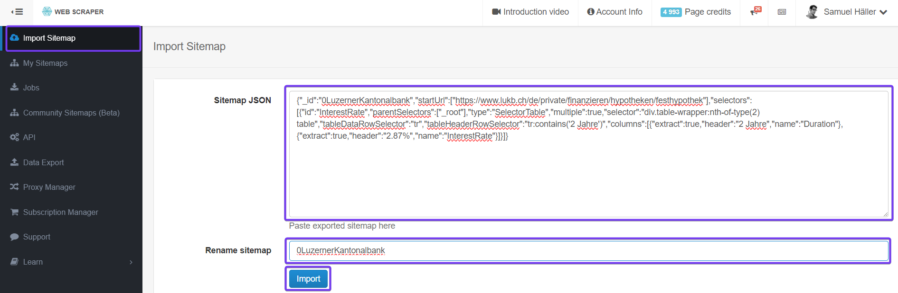

## Credit Suisse
<br><br>
Unfortunately, UBS doesn't offer their interest rates online on their website. Reference is made to the fact that these should be requested. Consequently, we've sought out the interest rates from Credit Suisse, as they provide them online. 

<br><br><br><br>

This documentation explains how you can retrieve the interest rates on the Credit Suisse website. In case you you don't have Webscraper.io installed yet - click [here](0Webscraper.io_Setup.md). 
<br><br>
If you have Websracper.io installed: Go to this [website](https://www.credit-suisse.com/ch/de/privatkunden/hypothek/services/hypothekarzinsen.html). 

1. Scroll down where the interest rates are shown.
2. Left click and select "inspect".
<br><br>


<br><br><br><br>

1. Select the section **Web Scraper**
2. **Create new sitemap**
3. **Create Sitemap**
<br><br>


<br><br><br><br>

1. Name the Sitemap - in this example its called ```0CreditSuisse```.
2. Enter the website ```https://www.credit-suisse.com/ch/en/private-clients/mortgages/services/mortgage-interest-rate.html```.
3. **Create Sitemap**
<br><br>


<br><br><br><br>

Since the data is distributed in several table columns (Duration, Interest, Duration, Interest), we cannot simply download the table here. We have to proceed as follows:
1. **Add new selector**
2. Name the selector - in this exampled ```InterestRate```
3. Select as a *Type* **Element**
4. Click in the line *Selector* on **Select**
5. Now you can mark the whole table with the interest rates (excluding the header). Sometimes the shift key has to be pressed to select all lines
6. **Done selecting**
7. **Save selector**
<br><br>


<br><br><br><br>

Select your created *selector*.
<br><br>


<br><br><br><br>

1. **Add new selector**
2. Name the selector - in this exampled ```InterestRate1```
3. Select as a *Type* **Text**
4. Click in the line *Selector* on **Select**
5. Now select only the first figure **2 years**
6. **Done selecting**
7. Tick the **Multiple** box
8. Go to **Data Preview**
<br><br>


<br><br><br><br>

Only one column is displayed in the *Data Preview*. In this column, the years (term) and the interest are displayed alternately. Unfortunately, the data can only be downloaded in this way. In the following steps, the data must be specially structured. Close the *Data Preview*.
<br><br>


<br><br><br><br>

Now we execute the webscraping.
1. Click on **Sitemap** ***0CreditSuisse***
2. Select **Scrape**
<br><br>


<br><br><br><br>

You are now asked about the request interval and page load delay. 

- Request interval: Determines the amount of time the scraper waits between sending requests to web pages.
- Page load delay: Specifies the duration the scraper waits for a page to fully load before extracting the data.
<br>
It's done to mimic human browsing behavior, avoid overloading the server, and reduce the chances of getting banned or blocked due to rapid or frequent requests. For the time being, we leave the default settings at 2000 miliseconds.
Therefore, just click **Start scraping**. If we then see that scraping is not working, we could always increase the time here.
<br><br>


<br><br><br><br>

A window now opens and closes itself again after a few seconds. After that click on **refresh**. You will now see the data that has been downloaded. Make sure that they are complete and the duration and interest rates are in the last column. Be aware that only the first few lines of the dataset are displayed.
<br><br>


<br><br><br><br>

Now go back to **Sitemaps** where you will see the created function for downloading the data from Credit Suisse.
<br><br>


<br><br><br><br>


### Webscraper.io - Cloud
<br><br>
We have now made the setup in the local webscraper.io application. In order for this to run automatically on a daily basis, we need to do the installation in webscraper.io cloud. How to get an cloud account you see [here](0Webscraper.io_Setup.md).
<br>
We now copy the settings from the sitemap we made. To do this, click on the sitemap **0CreditSuisse** in your Chrome browser.
<br><br>


<br><br><br><br>

Choose now the tab **Sitemap 0CreditSuisse** and select **Export Sitemap**.
<br><br>


<br><br><br><br>

Copy now the displayed code.
<br><br>


<br><br><br><br>

Now open your [Cloud account](https://cloud.webscraper.io) and go to **Import Sitemap**.
1. Paste the code you copied in the previous step
2. Name the *Sitemap* again - in this case ```0CreditSuisse```
3. **Import**
<br><br>


<br><br><br><br>

You have now created the sitemap in your cloud environment.
1. Click now on **Scrape** to see if it works correctly.
2. Wait a few seconds for the file to be created - reload the page after a few seconds.
3. Click on **Preview**.
<br><br>


<br><br><br><br>

Now check whether all content has been loaded here. If data is missing you have to run the setup again locally in your Chrome browser. You can then export the adjusted code again and insert it in your sitemap under **Edit**. 
<br><br>

<br><br>
Please be aware that only the first 10 lines are shown in *Data Preview*.
<br><br><br><br>

Every time a scrape is executed, this file is created. In order to be able to merge the data from all financial institutions into one file, we need to add the following columns so that we can distinguish the data:

- Name of the financial institution
- Date of download

In addition, we have to edit the data so that they look the same in all sitemaps (e.g. dot everywhere instead of comma for the separation of decimal places, etc.). We do this under **Praser**.
1. Go to **My Sitemaps**
2. Select **0CreditSuisse** Sitemap
3. Go to **Parser**. Here you see the existing columns.
4. **Add column**
<br><br>


<br><br><br><br>

We now add the a colum with the name of the financial institution. 
1. Name the column ```Financial_Institution```.
2. Select as source column **web-scraper-start-url**.
3. **Save**.
<br><br>


<br><br><br><br>

A new column has now been created. 
1. Go to **Add parser**
2. **Regex match**
<br><br>


<br><br><br><br>

Currently, the input is the URL where we download the data. We would like to get the name of the financial institution from this URL. For this we use a code in Regex. This shortens the URL accordingly.
<br>
1. Use the code ```www\.(.*?)\.com```
2. Select **Group 1**
3. As *Output* you should now get the name **credit-suisse**
4. **Save** 
<br><br>


<br><br><br><br>

Now we add a second column. Click on **Add time scraped**. You see now the added column *time-scraped*. Click now on the field **Convert UNIX timestamp**.
<br><br>


<br><br><br><br>

1. Select your preferred time **Format**.
2. Check the *Output*.
3. **Save**.
<br><br>


<br><br><br><br>

In the list below you will now see the updated list with the two added columns. The column InterestRate and Duration are still merged in the column *InterestRate1*. We cannot process this further in Webscraper.io. However, Google Sheets helps us here. Therefore, we are already done editing the data in Webscraper.io.
<br><br>


<br><br><br><br>

The last step in Webscraper.io is to set up a job to automatically download the data on a daily basis. To do this, go to **Schedule** in the corresponding sitemap.
<br>
1. **Enable scheduler**.
2. Set the *Scheduler Type* to **Daily**.
3. Under *Run a job on*, select the days on which the interest rate is to be updated. In this example, all weekdays are selected.
4. Specify the time when the job is to be run.
5. The remaining settings can be left as they are.
6. **Save**.
<br><br>


<br><br><br><br>

We have now made the settings so that the Credit Suisse interest rates are automatically extracted on a daily basis. 

<br><br><br><br>
### Google Sheets
<br><br>
Now, before we continue in Google Sheets, make sure that you have already done the general setup regarding Google Sheets. To do this, go back to [Webscraper.io_Setup](0Webscraper.io_Setup.md).
