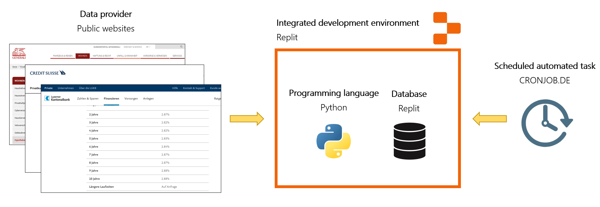
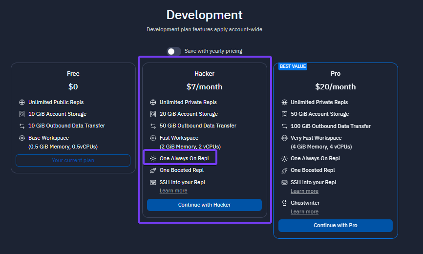

# General information about Replit
  
Replit.io, commonly referred to as Replit, is an online platform that offers an integrated development environment (IDE) where users can write, run, and share code in various programming languages directly in the browser. It facilitates collaborative coding, hosting web apps, and provides a range of educational resources for learners. Replit's mission is to make programming more accessible to a wider audience. Since it is an integrated development enivronment, users can access various services via one platform and do not have to worry about hosting or maintaining the different services. 

In this approach using Replit, we utilize the programming language Python. With the help of the Beautifulsoup package, we fetch data from the websites. All the code is provided in this repository. Therefore, one does not necessarily need to have Python knowledge to implement this method.

The following figure shows how the process looks for the daily download of data via API.

1. Data is sourced from various Swiss financial institutions. For this use case, we extract data from several Swiss companies. The process can be easily scaled to include more financial entities.
2. Replit is the IDE which is hosting our python script. With this script the data is fetched from the websited and stored directly in the Replit database.  
3. With the external application [CRONJOB.DE](https://www.cronjob.de/) we are able to execute the python script daily.
4. When we extract the data from the database, we structure and format it in advance, allowing the data to be downloaded as a structured CSV. 

Compared to extraction via an API, webscraping provides less structured data due to varying homepage layouts and content across sites. Data cleansing and structuring become more critical and constitute a significant portion of the task with webscraping.

  
For a few websites, scraping with python (beautfiulsoup) did not work as they use a webscraper blocker. Additionally, no data can be downloaded if the website, or at least a part of it, is set up using JavaScript. In the list below, some Swiss financial institutions are mentioned for which an attempt was made to download the interest rates using python (beautfiulsoup). 

| Financial institution  | Website                | Webscraper.io         |
|--------------------    |---------------------   |-------------------    |
| AXA Schweiz | https://www.axa.ch/de/privatkunden/angebote/wohnen-eigentum/hypotheken.html | Does *not* work|
| Bank Cler | https://www.cler.ch/de/hypotheken-und-kredite/hypotheken/hypothekarzinsen| Does *not* work|
| Bank WIR| https://www.wir.ch/de/produkte-loesungen/geschaeftskunden/finanzieren/hypotheken/festhypotheken | Works |
| Credit Suisse| https://www.credit-suisse.com/ch/de/privatkunden/hypothek/services/hypothekarzinsen.html | Does *not* work |
| Generali Insurance| https://www.generali.ch/privatkunden/wohnen-bauen/hypotheken | Works |
| Luzerner Kantonalbank| https://www.lukb.ch/de/private/finanzieren/hypotheken/festhypothek | Works |
| Luzerner Pensionskasse| https://www.lupk.ch/de/hypotheken-vorbezug | Works |
| Migros Bank| https://www.migrosbank.ch/de/privatpersonen/hypotheken-kredite/hypotheken/festhypothek.html | Works |
| Nidwaldern Kantonalbank| No interest rates online - only on request | Does *not* work |
| Obwaldner Kantonalbank| No interest rates online - only on request | Does *not* work |
| Pensionskasse Post| https://hypotheca.pkpost.ch/?lang=de | Works |
| Pensionskasse SBB| https://www.pksbb.ch/de/hypotheken/zinssaetze | Works |
| PostFinance| https://www.postfinance.ch/de/privat/produkte/hypotheken/zinssaetze-hypotheken.html?gad=1&gclid=CjwKCAjw3dCnBhBCEiwAVvLcu6ErynKha19h1Z-fJCizvungMx886DqeRR-rDyTyElKdvkY9LgM-MxoC-x4QAvD_BwE&gclsrc=aw.ds | Works |
| Raiffeisen Luzern| https://www.raiffeisen.ch/luzern/de/privatkunden/hypotheken/hypothekenzinsen.html#bankselector-focus | Does *not* work |
| Swiss Life| https://www.swisslife.ch/de/private/produkte/hypotheken/aktuelle-zinssaetze.html | Works |
| UBS | No interest rates online - only on request  | Does *not* work |
| Urner Kantonalbank| No interest rates online - only on request  | Does *not* work |
| Zuger Kantonalbank| https://www.zugerkb.ch/private/hypotheken/hypothekarzinsen | Works |
| Zürcher Kantonalbank| https://www.zkb.ch/de/private/hypotheken-immobilien/hypotheken-zinsen/aktuelle-hypothekarzinsen.html | Works |
| Zurich Insurance| https://www.zurich.ch/de/privat/wohnen-events/wohneigentum/hypothek | Works |

    

## Result
The end result is a database with daily records on the requested shares. 
  

  
This data can be downloaded in a csv file.

    

## Running costs
 

| Application  | Free Version  | Note          |
|-----------   |---------------|---------------|
| REPLIT     | (yes)       | The "Hacker" subscription is required as the "Always On" functionality is required in the process. This subscription costs USD 7 per month. |
| CRONJOB.DE | yes         | |

  

Here the detailed costs of Replit: [Pricing](https://replit.com/pricing).  
 

