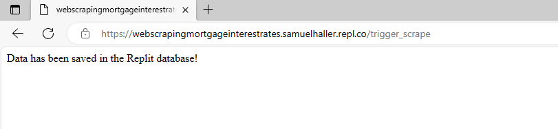
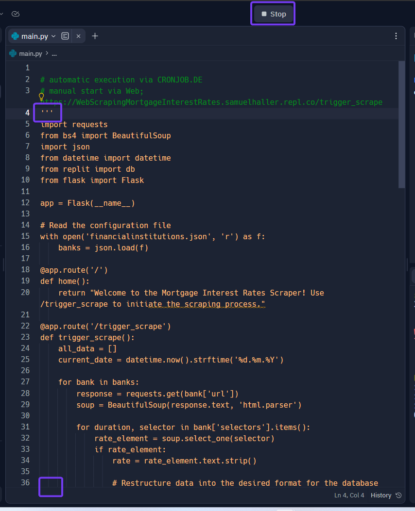

# Setup

<br><br>

This document demonstrates how to set up Replit and Cronjob.de in general. In the subsequent documents, it is explained how the code needs to be extended to add the financial institutions from where we fetch the interest rates data. It is shown how to download the interest rates from the following websites:

<br><br>

- [Luzerner Kantonalbank](1Replit_LuzernerKantonalbank.md)
- [Credit Suisse](1Replit_CreditSuisse.md)
- [Generali Insurance](1Replit_Generali.md)

<br><br>
Follow this guide to get started.

<br><br><br><br>

### 1. Setup Replit
<br><br>
Open an account with Replit - you can do this under the following [link](https://replit.com/login). Enter your details - the login process should be self-explanatory. 
<br><br>


<br><br><br><br>

After you have registered, you will see this screen. To start the project you have to create your first Repl (short for "Read-Eval-Print Loop"). Click on **Create Repl**.
<br><br>


<br><br><br><br>

A new window opens. 
1. Select Python as a template
2. Name your Repl ```WebScraping_MortgageInterestRates```
3. Decide if you want to have a private or public Repl<br>
   Difference:<br>
   For a public Repl, other users can see your code, but they cannot directly modify it. However, they can create their own copy (Fork) of the Repl and make changes to that copy without affecting your original code.
   With a private Repl, no one except you (or those you explicitly grant access to) can see or modify the code. For a private Repl, you must have a paid user subscription.
4. **Create Repl**
<br><br>


<br><br><br><br>

Once you have created your Repl, the following screen appears in which you manage your Repl. There are four different sections:
 - Files
 - Tools
 - Script (main.py)
 - Console
<br><br>


<br><br><br><br>

Within Python, we use predefined programs, which we can incorporate into our code. To install these, go to **Tools** and click on **Packages**.

Install the following packages:

- beautfulsoup4
- Flask
- requests
- pandas
- replit 
<br><br>
In order to install the packages, you must first search for them in the search field - then you can install them.
<br><br>


<br><br><br><br>

In our Python script **main.py** we will now enter various codes to do the setup. We start with the following code:

```
import requests
from bs4 import BeautifulSoup

url = 'https://www.lukb.ch/de/private/finanzieren/hypotheken/festhypothek'
response = requests.get(url)

soup = BeautifulSoup(response.content, 'html.parser')

# Extracting the terms
terms = [th.text.strip() for th in soup.find_all('th')]

# Extracting the interest rates
interest_rates = [td.find('p').text.strip() if td.find('p') else td.text.strip() for td in soup.find_all('td')]

# Combining both lists into a dictionary
data = dict(zip(terms, interest_rates))

# Displaying the data
for term, interest_rate in data.items():
    print(f"Term: {term}, Interest Rate: {interest_rate}")
```
<br><br>
If there is a **#** at the beginning of a line, then it is a comment. A comment is never executed and serves only for your information what the code stands for.
<br><br>
Enter the code in the script. We want to test whether we can download the data from the Luzerner Kantonalbank. 
1. Copy the text into the script
2. Execute the script - click **Run**
3. You should now see the data in the *console*
4. Now delete the code in **main.py** again - we have done this step only for testing purposes
<br><br>

<br><br>
If this does not work, check again if you have installed all relevant packages. If it still doesn't work, something has probably changed on the Luzerner Kantonalbank homepage. In this case, continue with the next steps nevertheless.

<br><br><br><br>

In order to be able to download the interest rates of several financial institutions, we write the specifications of the website in a separate list. The code in **main.py** therefore always remains the same - regardless of the number of websites from which we extract the data. This makes the setup easier.

Copy therefore the following code:

```
[
    {
        "name": "LUKB",
        "url": "https://www.lukb.ch/de/private/finanzieren/hypotheken/festhypothek",
        "selectors": {
            "2 Jahre": "th:-soup-contains('2 Jahre') + td p",
            "3 Jahre": "th:-soup-contains('3 Jahre') + td p",
            "4 Jahre": "th:-soup-contains('4 Jahre') + td p",
            "5 Jahre": "th:-soup-contains('5 Jahre') + td p",
            "6 Jahre": "th:-soup-contains('6 Jahre') + td p",
            "7 Jahre": "th:-soup-contains('7 Jahre') + td p",
            "8 Jahre": "th:-soup-contains('8 Jahre') + td p",
            "9 Jahre": "th:-soup-contains('9 Jahre') + td p",
            "10 Jahre": "th:-soup-contains('10 Jahre') + td p"
        }
    },
    {
        "name": "MigrosBank",
        "url": "https://www.migrosbank.ch/de/privatpersonen/hypotheken/festhypothek",
        "selectors": {
            "2 Jahre": "td:-soup-contains('2 Jahre') + td + td",
            "3 Jahre": "td:-soup-contains('3 Jahre') + td + td",
            "4 Jahre": "td:-soup-contains('4 Jahre') + td + td",
            "5 Jahre": "td:-soup-contains('5 Jahre') + td + td",
            "6 Jahre": "td:-soup-contains('6 Jahre') + td + td",
            "7 Jahre": "td:-soup-contains('7 Jahre') + td + td",
            "8 Jahre": "td:-soup-contains('8 Jahre') + td + td",
            "9 Jahre": "td:-soup-contains('9 Jahre') + td + td",
            "10 Jahre": "td:-soup-contains('10 Jahre') + td + td"
        }
    }
  ]
```
<br><br>
Create now a json-file. On the left side next to **Files** there is a **+** sign. Click on this sign and create a new file with the name ```financialinstitutions.json```. It is important that you use exactly this name, because our code will look for this file afterwards.
<br><br>

<br><br>
We again use the Luzerner Kantonalbank and MigrosBank as examples. 

***How you can set up these banks or extend the code to other banks is shown in the other documents in this repository.*** 

<br><br><br><br>

We now enter a code in **main.py** to extract the data. Now copy the following code and paste it into Replit.

```
# Testing - Extracting the data manually 

import requests
from bs4 import BeautifulSoup
import json

# Read the configuration file
with open('financialinstitutions.json', 'r') as f:
    banks = json.load(f)

all_data = {}

for bank in banks:
    response = requests.get(bank['url'])
    soup = BeautifulSoup(response.text, 'html.parser')

    bank_data = {}
    for duration, selector in bank['selectors'].items():
        rate_element = soup.select_one(selector)
        if rate_element:
            bank_data[duration] = rate_element.text.strip()

    all_data[bank['name']] = bank_data

# Display or save data
print(all_data)
```
<br><br>
When you have inserted the code, execute it with **Run**.
<br><br>

<br><br>
You should now see a data record for LUKB and MigrosBank in the console. 

<br><br><br><br>

The manual download of the data is the first part of the code, which we have in our script. However, we will now add other tasks to the script. In order to execute only one task at a time, however, we need to inactivate the rest of the code. This can be done by excluding the code with the characters ```'''```. As soon as the characters appear orange, these lines are no longer executed. Set the code inactive by placing ```'''``` before and after the code. If something is in green, it means that this is a comment. This is purely informative and is never executed.
<br><br>


<br><br><br><br>

We have now downloaded the data with the previous code - but now we have done it manually. However, in order to be able to download the data automatically on a daily basis, we need to extend the code. 
<br><br>
Now copy this code and add it to the **main.py** file at the top (do not delete the inactive code):
<br><br>
```
# Code for the automatic triggering of the job via web (CRONJOB.DE)  
# manual start via Web; https://WebScrapingMortgageInterestRates.samuelhaller.repl.co/trigger_scrape

import requests
from bs4 import BeautifulSoup
import json
from datetime import datetime
from replit import db
from flask import Flask

app = Flask(__name__)

# Read the configuration file
with open('financialinstitutions.json', 'r') as f:
    banks = json.load(f)

@app.route('/')
def home():
    return "Welcome to the Mortgage Interest Rates Scraper! Use /trigger_scrape to initiate the scraping process."

@app.route('/trigger_scrape')
def trigger_scrape():
    all_data = []
    current_date = datetime.now().strftime('%d.%m.%Y')

    for bank in banks:
        response = requests.get(bank['url'])
        soup = BeautifulSoup(response.text, 'html.parser')

        for duration, selector in bank['selectors'].items():
            rate_element = soup.select_one(selector)
            if rate_element:
                rate = rate_element.text.strip()

                # Restructure data into the desired format for the database
                record = {
                    "Name": bank['name'],
                    "Duration": duration,
                    "InterestRate": rate,
                    "time-of-scraping": current_date
                }
                all_data.append(record)

    # Store data in the Replit database
    for record in all_data:
        # Use a combination of Name, Duration, and time-of-scraping as the key
        key = f"{record['Name']}_{record['Duration']}_{record['time-of-scraping']}"
        db[key] = record

    return "Data has been saved in the Replit database!"

@app.route('/cronjob_78641.html')
def cronjob_verification():
    return "cronjob.de"

if __name__ == "__main__":
    app.run(host='0.0.0.0', port=3000)
```
<br><br>
This code includes the following items:

1. Import all functions and packages which are required. With the *Flask* package we will be able to trigger the code via web.
2. Downloads the data from the websited we have defined in the **financialinstitutions.json** file.
3. Restructure data into the desired format for the database - including the date of the extraction.
4. Safes the data in the database.

When you have entered the code in **main.py** execute the script and click **Run** (before you execute the code make sure that only this code is activated).
<br><br>

<br><br>
A webview will now open on the right-hand side. You will now see a link with your project und user name. Copy this link and write it into your code in the script (line 3 in the image above). Add ```https://``` to the front of the code and add ```/trigger_scrape``` to the back. In this example the code is *https://WebScrapingMortgageInterestRates.samuelhaller.repl.co/trigger_scrape*.
<br><br>
This is the code with which you execute the script. Whenever you enter this code in a webbrowser, your python code gets triggered. We will execute this in a later step.

<br><br><br><br>

In order for this code to be called via external web, the script must always be running. In other words, the cloud server must be online so that the script can download the data from the webpages at all time. To ensure that the script is always running and does not automatically go offline after some time, we must activate **Always On**. To do this, click on the blue Python symbol at the top right. In order to activate this, you must either buy "My Cicles" or make a paid subscription. It is recommended to make a **Hacker** subscription. With this subscription you also get more storage space in your database and the *Always On* functionality is included in this package. You can find the prices [here](https://replit.com/pricing).
<br><br>
If you have bought the "My Cicles" or made the subscription, activate the **Always On** function.
<br><br>


<br><br><br><br>

Execute now your code again and click on **Run**. The code will now be activated untill you *stop* it.
<br><br>


<br><br><br><br>

Now open a new tab of the web browser and enter the link we defined in the previous steps. In this example the link is called: *https://WebScrapingMortgageInterestRates.samuelhaller.repl.co/trigger_scrape*
<br><br>

<br><br>
When the link is loaded, the web page should display the following: *Data has been saved in the Replit database!*

<br><br><br><br>

In summary, the following can be said:
<br><br>
Code: **https://WebScrapingMortgageInterestRates.samuelhaller.repl.co/**    (acc. Replit webview)
  * Checks if the code runs.
  * *Can be triggered when code is executed in Replit (**Run**) or the link is entered on the web.*
  * Gives as response *Welcome to the Mortgage Interest Rates Scraper! Use /trigger_scrape to initiate the scraping process.*
<br><br>  
Code: **https://WebScrapingMortgageInterestRates.samuelhaller.repl.co/trigger_scrape**
  * Is executing the code and downloads the stock data.
  * *Can only be executed via web.*
  * Gives as response *Data has been saved in the Replit database!*

<br><br><br><br>

Since we have now executed the code and entered *https://WebScrapingMortgageInterestRates.samuelhaller.repl.co/trigger_scrape* on the web, the data has been downloaded. Go back to your Repl - we are now checking if anything has been saved in the database.
<br><br>
1. Click on **Database** under **Tools** at the bottom left.
2. A tab **Database** opens on the right-hand side - there you will see that there are **keys** in the database. This is the number of data records contained in the database.
<br><br>  

<br><br>
In this case we see that 18 data records have been saved.

<br><br><br><br>

Now stop the code and make the code inactive by placing the characters ```'''``` around the code. We do this to be able to complete the code further. 
<br><br>  


<br><br><br><br>

To retrieve the data from the database, you can add the following code to our **main.py** file. Enter the code at the end. 
<br><br>
```
# Retrieve data from database

from replit import db
from datetime import datetime

# Retrieve all values from the database
all_data = [db[key] for key in db.keys()]

# Sort the data
sorted_data = sorted(all_data, key=lambda x: (x['Name'], datetime.strptime(x['time-of-scraping'], '%d.%m.%Y'), x['Duration']))

# Display the sorted data in the desired format
print("Name, Duration, InterestRate, time-of-scraping")

# Set to track already displayed records
displayed_records = set()

for record in sorted_data:
    # Extract only numeric characters from "Duration"
    duration = ''.join(filter(str.isdigit, record['Duration']))
    
    # Convert "InterestRate" to the desired format
    try:
        # Replace comma with dot and convert to a floating-point number
        interest_rate = float(record['InterestRate'].replace(',', '.').replace('%', ''))
        # Format to the desired format
        interest_rate_str = f"{interest_rate:.3f}"
    except ValueError:
        interest_rate_str = record['InterestRate']

    # Create a unique identifier for each record
    unique_id = f"{record['Name']}{duration}{interest_rate_str}{record['time-of-scraping']}"

    # Check if the record has already been displayed
    if unique_id not in displayed_records:
        print(f"{record['Name']}, {duration}, {interest_rate_str}, {record['time-of-scraping']}")
        displayed_records.add(unique_id)
```
<br><br>  
This code retrieves the data from the database and structures it into a table format with the following columns:
- Name
- Duraiton (term)
- InterestRate
- time of scraping

<br><br>  
In addition, all duplicates are deleted.
<br><br>  

<br><br> 
In this example we now see the 18 data sets. 
<br><br> 
Now set this code to inactive as well by using the ```'''``` characters.

<br><br><br><br>

The next code is for loading the data from the database into a csv file. This can then simply be downloaded. Copy the following code.
<br><br> 
```
# Create csv file

import requests
from bs4 import BeautifulSoup
import json
from datetime import datetime
from replit import db
import csv

# Retrieve all values from the database
all_data = [db[key] for key in db.keys()]

# Sort the data
sorted_data = sorted(all_data, key=lambda x: (x['Name'], datetime.strptime(x['time-of-scraping'], '%d.%m.%Y'), x['Duration']))

# Open CSV file for writing
with open('output.csv', 'w', newline='', encoding='utf-8') as csvfile:
    csvwriter = csv.writer(csvfile)
    
    # Write the header row
    csvwriter.writerow(["Name", "Duration", "InterestRate", "time-of-scraping"])

    # Set to track already written records
    written_records = set()

    for record in sorted_data:
        # Extract only numeric characters from "Duration"
        duration = ''.join(filter(str.isdigit, record['Duration']))
        
        # Convert "InterestRate" to the desired format
        try:
            # Replace comma with dot and convert to a floating-point number
            interest_rate = float(record['InterestRate'].replace(',', '.').replace('%', ''))
            # Format to the desired format
            interest_rate_str = f"{interest_rate:.3f}"
        except ValueError:
            interest_rate_str = record['InterestRate']

        # Create a unique identifier for each record
        unique_id = f"{record['Name']}{duration}{interest_rate_str}{record['time-of-scraping']}"

        # Check if the record has already been written
        if unique_id not in written_records:
            csvwriter.writerow([record['Name'], duration, interest_rate_str, record['time-of-scraping']])
            written_records.add(unique_id)

print("Data has been written to the output.csv file!")
```
Enter the code at the end of your existing script **main.py** and press **Run**.
<br><br>

<br><br>
Now make the code inactive again by placing the characters ```'''``` around the code.

<br><br><br><br>

On the left side under **Files** the file **output.csv** has now been created. If you click on it, you will see the data contained in this csv. You can now download this csv for your further use.
<br><br>

<br><br>
When the data is loaded into a csv, the current data in the database is downloaded. When the database expands, the csv file is not automatically expanded. In this case you have to delete it manually (*right click on the file and **delete***) - then you can generate a new csv file with the new data by executing the respecitve code.

<br><br><br><br>

To delete the data in the database itself, one must enter the following code.

Copy this code and paste it at the end of our script.
<br><br>
```
# Clear database

from replit import db

# Retrieve all keys from the database
all_keys = list(db.keys())

# Delete each key from the database
for key in all_keys:
    del db[key]

print("All entries have been deleted from the Replit database!")
```
<br><br>
Before you run the code, make sure that all other codes are disabled. If this is the case, click **Run**.
<br><br>

<br><br>
When you have executed the code:
1. Click under **Tools** on **Database**.
2. In the top right window you will now see the **Database** tab. This tab should now show that there are no more datasets. 

<br><br><br><br>

Again, set this code to inactive by using the ''' characters.
<br><br>


<br><br><br><br>

We now have the codes for the following tasks in our **main.py** script:
<br><br>
- Code for the automatic triggering of the job via web
- Manual download of the data
- Retrieve data from database
- Create csv file
- Clear database

<br><br>
In order for the code *Code for the automatic triggering of the job via web* to be executed automatically every day and thus download the data daily and save it in the database, we have to set up a cron job.
<br><br>
A cron job is a scheduled task in Unix-like operating systems that runs at fixed times, dates, or intervals. It is typically used for automating system maintenance or administration tasks.

<br><br><br><br>

### 2. CRONJOB.DE
<br><br>
To ensure that the script now runs daily, we now call up the URL-link (https://WebScrapingMortgageInterestRates.samuelhaller.repl.co/trigger_scrape - *your URL is different*) daily with the help of CRONJOB.DE. To do this, we have to register on CRONJOB.DE. The page is in German. You can also use another cronjob provider if you want to have a page in English. There are many providers in this area.
<br><br>
Register yourself on [CRONJOB.DE](https://www.cronjob.de/anmeldung). The registration process should be self-explanatory.
<br><br>


<br><br><br><br>

In the **Home** menu, click on **Cronjobs**.
<br><br>


<br><br><br><br>

Click on the button **Neuen CRONJOB anlegen**.
<br><br>


<br><br><br><br>

1. Name your CRONJOB - in this examble ```WebScraping_Replit```
2. Enter your URL address - make sure that the URL starts with **https://** and ends with **/trigger_scrape**. See example in the figure below
3. Define the schedule - in this examble every weekday
4. Safe CRONJOB. **CRONJOB speichern**
<br><br>


<br><br><br><br>

After setting up the cronjob, you will be prompted to run a verification. This is asked to ensure that you are authorised to create this cronjob for the relevant server (Replit). 
<br>
In this example, we must now create an html file in Replit with the name **cronjob_78641.html**. This file should contain the content **cronjob.de**. Before you click on the **Prüfung jetzt durchführen** button, you can check manually with the shown link (**https://WebScrapingMortgageInterestRates.samuelhaller.repl.co/cronjob_78641.html**) whether the verification works. We do this at a later step when the html file is created.  
<br><br>


<br><br><br><br>

Go back to your Repl and open a html file. In this example it is called **cronjob_78641.html** - you will have a different number. Then open the file and put ```cronjob.de``` in it. 
<br><br>


<br><br><br><br>

Now go back to the script (**main.py**) and go to the top where you see the **Code for the automatic triggering of the job via web**. Within this code you see a line with **@app.route('/cronjob_78641.html')**. Now change the number to match the title of your html file. 
<br><br>


<br><br><br><br>

Now make sure that only the code *Code for automatically triggering the job via the web* is activated. The rest should be set to inactive with the characters ```'''```.

Press on the **Run** button.
<br><br>


<br><br><br><br>

Now enter your verification link (in this case:**https://WebScrapingMortgageInterestRates.samuelhaller.repl.co/cronjob_78641.html**) in the web browser. If the result is **cronjob.de**, everything works. Otherwise, check the previous steps again.
<br><br>


<br><br><br><br>

If it worked, you can now run the check in CRONJOB.DE. **Prüfung jetzt durchführen**
<br><br>

<br>
Afterwards, a message appears if it has worked.

<br><br><br><br>

***The setup is now complete and everything should work.***

<br><br><br><br>

Make sure that only the code needed for the automatic download of the data via cronjob is activated. Also make sure that the **script is running**. If the script is not running, nothing can be triggered via the web. 
<br><br><br><br>

## Here a quick summary about the setup

<br><br><br>
### Web links

<br>

Code: **https://WebScrapingMortgageInterestRates.samuelhaller.repl.co/**    (acc. Replit webview)
  * Checks if the code runs.
  * *Can be triggered when code is executed in Replit (**Run**) or the link is entered on the web.*
  * Gives as response *Welcome to the Mortgage Interest Rates Scraper! Use /trigger_scrape to initiate the scraping process.*

<br>

Code: **https://WebScrapingMortgageInterestRates.samuelhaller.repl.co/trigger_scrape**
  * Is executing code and downloads data.
  * *Can only be executed via the web.*
  * Gives as response *Data has been saved in the Replit database!*

<br>

Code: **https://WebScrapingMortgageInterestRates.samuelhaller.repl.co/cronjob_78641.html**
  * Is required for the verification in CRONJOB.DE.
  * Must be performed once.
  * *Can only be executed via the web.*
  * Gives as response "cronjob.de"
<br><br>

*Please have in mind, that your URL link looks different since the code is depending on your project and user name (and verification number from CRONJOB.DE).*

<br><br><br>
### Python script - different codes

<br>

In our script we have the following codes:
<br>
1. Automatic download of data via cronjob
2. Manual download of the data
3. Viewing the database
4. Creation of a csv file
5. Deleting the database

<br><br>

Make sure of the following:
 * That the script is **always** running. If the script is not running, nothing can be triggered via the web.
 * That only the first code (**Automatic download of data via cronjob**) is set to active.


