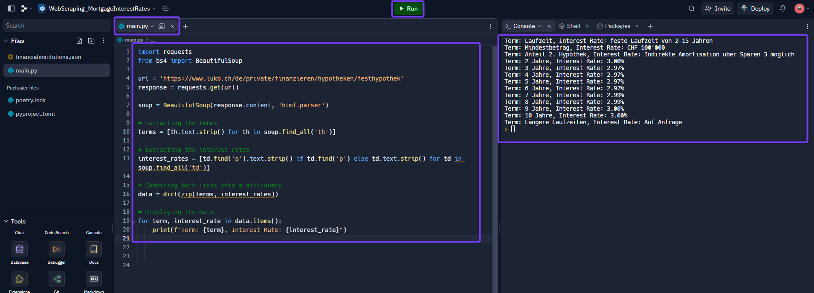

# Setup

<br><br>

This document demonstrates how to set up Replit and Cronjob.de. In the subsequent documents, it is explained how the code needs to be extended to add the financial institutions from where we fetch the interest rates data. It is shown how to download the interest rates from the following websites:

<br><br>

- [Luzerner Kantonalbank](1Replit_LuzernerKantonalbank.md)
- [Credit Suisse](1Replit_CreditSuisse.md)
- [Generali Insurance](1Replit_Generali.md)

<br><br>
Follow this guide to get started.

<br><br><br><br>

### 1. Setup Replit
<br><br>
Open an account with Replit - you can do this under the following [link](https://replit.com/login). Enter your details - the login process should be self-explanatory. 
<br><br>


<br><br><br><br>

After you have registered, you will see this screen. To start the project you have to create your first Repl (short for "Read-Eval-Print Loop"). Click on **Create Repl**.
<br><br>


<br><br><br><br>

A new window opens. 
1. Select Python as a template
2. Name your Repl ```WebScraping_MortgageInterestRates```
3. Decide if you want to have a private or public Repl<br>
   Difference:<br>
   For a public Repl, other users can see your code, but they cannot directly modify it. However, they can create their own copy (Fork) of the Repl and make changes to that copy without affecting your original code.
   With a private Repl, no one except you (or those you explicitly grant access to) can see or modify the code. For a private Repl, you must have a paid user subscription.
4. **Create Repl**
<br><br>


<br><br><br><br>

Once you have created your Repl, the following screen appears in which you manage your Repl. There are four different sections:
 - Files
 - Tools
 - Script (main.py)
 - Console
<br><br>


<br><br><br><br>

Within Python, we use two predefined programs, which we can incorporate into our code. To install these, go to **Tools** and click on **Packages**.

Install the following packages:

- beautfulsoup4
- Flask
- requests
- pandas
- replit 
<br><br>
In order to install the packages, you must first search for them in the search field - then you can install them.
<br><br>


<br><br><br><br>

In our Python script **main.py** we will now enter various codes to do the setup. We start with the following code:

```
import requests
from bs4 import BeautifulSoup

url = 'https://www.lukb.ch/de/private/finanzieren/hypotheken/festhypothek'
response = requests.get(url)

soup = BeautifulSoup(response.content, 'html.parser')

# Extracting the terms
terms = [th.text.strip() for th in soup.find_all('th')]

# Extracting the interest rates
interest_rates = [td.find('p').text.strip() if td.find('p') else td.text.strip() for td in soup.find_all('td')]

# Combining both lists into a dictionary
data = dict(zip(terms, interest_rates))

# Displaying the data
for term, interest_rate in data.items():
    print(f"Term: {term}, Interest Rate: {interest_rate}")
```
<br><br>
If there is a **#** at the beginning of a line, then it is a comment. A comment is never executed and serves only for your information what the code stands for.
<br><br>
Enter this in the script. We want to test whether we can download the data from the Luzerner Kantonalbank. 
1. Copy the text into the script
2. Execute the script
3. You should now see the data in the console
4. *Now delete the code in **main.py** again - we have done this step for testing purposes
<br><br>

<br><br>
If this does not work, check again if you have installed all relevant packages. If it still doesn't work, something has probably changed on the Luzerner Kantonalbank homepage. In this case, continue with the next steps nevertheless.

<br><br><br><br>

In order to be able to download the interest rates of several financial institutions, we write the specifications of the website in a separate list. The code in **main.py** therefore always remains the same - regardless of the number of websites from which we extract the data. This makes the setup easier.

On the left side next to **Files** there is a **+** sign. Click on this sign and create a new file with the name ```financialinstitutions.json```. It is important that you use exactly this name, because our code will look for this file afterwards.

Now enter the following code in this file:

```
[
    {
        "name": "LUKB",
        "url": "https://www.lukb.ch/de/private/finanzieren/hypotheken/festhypothek",
        "selectors": {
            "2 Jahre": "th:-soup-contains('2 Jahre') + td p",
            "3 Jahre": "th:-soup-contains('3 Jahre') + td p",
            "4 Jahre": "th:-soup-contains('4 Jahre') + td p",
            "5 Jahre": "th:-soup-contains('5 Jahre') + td p",
            "6 Jahre": "th:-soup-contains('6 Jahre') + td p",
            "7 Jahre": "th:-soup-contains('7 Jahre') + td p",
            "8 Jahre": "th:-soup-contains('8 Jahre') + td p",
            "9 Jahre": "th:-soup-contains('9 Jahre') + td p",
            "10 Jahre": "th:-soup-contains('10 Jahre') + td p"
        }
    },
    {
        "name": "MigrosBank",
        "url": "https://www.migrosbank.ch/de/privatpersonen/hypotheken/festhypothek",
        "selectors": {
            "2 Jahre": "td:-soup-contains('2 Jahre') + td + td",
            "3 Jahre": "td:-soup-contains('3 Jahre') + td + td",
            "4 Jahre": "td:-soup-contains('4 Jahre') + td + td",
            "5 Jahre": "td:-soup-contains('5 Jahre') + td + td",
            "6 Jahre": "td:-soup-contains('6 Jahre') + td + td",
            "7 Jahre": "td:-soup-contains('7 Jahre') + td + td",
            "8 Jahre": "td:-soup-contains('8 Jahre') + td + td",
            "9 Jahre": "td:-soup-contains('9 Jahre') + td + td",
            "10 Jahre": "td:-soup-contains('10 Jahre') + td + td"
        }
    }
  ]
```
<br><br>

<br><br>
We again use the Luzerner Kantonalbank and MigrosBank as examples. 

***How you can set up these banks or extend the code to other banks is shown in the other documents in this repository.*** 

<br><br><br><br>

We now enter a code in **main.py** to extract the data. Now copy the following code and paste it into Replit.

```
# Testing - Extracting the data manually 

import requests
from bs4 import BeautifulSoup
import json

# Read the configuration file
with open('financialinstitutions.json', 'r') as f:
    banks = json.load(f)

all_data = {}

for bank in banks:
    response = requests.get(bank['url'])
    soup = BeautifulSoup(response.text, 'html.parser')

    bank_data = {}
    for duration, selector in bank['selectors'].items():
        rate_element = soup.select_one(selector)
        if rate_element:
            bank_data[duration] = rate_element.text.strip()

    all_data[bank['name']] = bank_data

# Display or save data
print(all_data)
```
<br><br>
When you have inserted the code, execute it with **Run**.
<br><br>

<br><br>
You should now see a data record for LUKB and MigrosBank in the console. 

<br><br><br><br>

The manual download of the data is the first part of the code, which we have in our script. However, we will now add other tasks to the script. In order to execute only one task at a time, however, we need to inactivate the rest of the code. This can be done by excluding the code with the characters ```'''```. As soon as the characters appear orange, these lines are no longer executed. Set the code inactive by placing ```'''``` before and after the code. 
<br><br>


<br><br><br><br>

We have now downloaded the data with the previous code - but now we have done it manually. However, in order to be able to download the data automatically on a daily basis, we need to extend the code. 
<br><br>
Now copy this code and add it to the main.py file at the top (dont delete the inactive code):
<br><br>
```
import requests
from bs4 import BeautifulSoup
import json
from datetime import datetime
from replit import db
from flask import Flask

app = Flask(__name__)

# Read the configuration file
with open('financialinstitutions.json', 'r') as f:
    banks = json.load(f)

@app.route('/')
def home():
    return "Welcome to the Mortgage Interest Rates Scraper! Use /trigger_scrape to initiate the scraping process."

@app.route('/trigger_scrape')
def trigger_scrape():
    all_data = []
    current_date = datetime.now().strftime('%d.%m.%Y')

    for bank in banks:
        response = requests.get(bank['url'])
        soup = BeautifulSoup(response.text, 'html.parser')

        for duration, selector in bank['selectors'].items():
            rate_element = soup.select_one(selector)
            if rate_element:
                rate = rate_element.text.strip()

                # Restructure data into the desired format for the database
                record = {
                    "Name": bank['name'],
                    "Duration": duration,
                    "InterestRate": rate,
                    "time-of-scraping": current_date
                }
                all_data.append(record)

    # Store data in the Replit database
    for record in all_data:
        # Use a combination of Name, Duration, and time-of-scraping as the key
        key = f"{record['Name']}_{record['Duration']}_{record['time-of-scraping']}"
        db[key] = record

    return "Data has been saved in the Replit database!"

if __name__ == "__main__":
    app.run(host='0.0.0.0', port=3000)
```
<br><br>
This code includes the following items:

1. Import all functions and packages which are required. With the Flask package we will be able to trigger the code via web.
2. Downloads the data from the websited we have defined in the **financialinstitutions.json** file.
3. Restructure data into the desired format for the database - including the date of the extraction.
4. Safes the data in the database.

When you have entered the code in **main.py** execute the script and click **Run** (before you execute the code make sure that only this code is activated).
<br><br>

<br><br>


Always On

Database - inhalt.


Once you have done this, you have completed the local setup. 
<br><br><br><br>
### 2. Webscraper.io - Cloud
<br><br>
In order to retrieve the data on a daily basis, the cloud version is required. To do this, go back to the [Webscraper.io](https://webscraper.io/) homepage. Click this time on **Cloud Login**.
<br><br>


<br><br><br><br>

Create a new web scraper account. The login process should be self-explanatory.
<br><br>


<br><br><br><br>

Webscraper.io - Cloud has several functionalities. The most important ones are described here:
<br>
- Import Sitemaps (create new sitemaps)
- My Sitemap ( shows all created sitemaps)
- Jobs ( shows all files created by scraping)
- Data Export (this function loads the data into Google Sheets)
- Subscription Manager (needed to request the appropriate subscription)
<br><br>


<br><br><br><br>

In order to use the relevant functions in the cloud application, you need a paid account. Go to **Subscription Manager** and create a **Project account**. This costs USD 50 per month. You can find out more about pricing [here](0Webscraper.io_General-Information.md).
<br><br>


<br><br><br><br>

We have now installed webscraper both locally and in the cloud. 
<br><br>
Now we need to download the content from the respective websites. In this repository there is a description of how this can be implemented for the following websites:
<br><br>
- [Luzerner Kantonalbank](1Webscraper.io_LuzernerKantonalbank.md)
- [Credit Suisse](1Webscraper.io_CreditSuisse.md)
- [Generali Insurance](1Webscraper.io_Generali.md)
<br>

Click on the corresponding websites and do the setup. You can also extend your data collection to other websites. The process is always the same. Depending on how the data is prepared on the website, there are slight adjustments. 
<br><br>
A list of financial institutions for which Webscraper.io works can be found under [Webscraper.io_General-Information](0Webscraper.io_General-Information.md).
<br><br>
When you have done the setup in Webscraper.io according to the descriptions for the configuration of the respective websites, you can continue with the process below.

<br><br><br><br>

### 3. Google Sheets
<br><br>
The export in this use case is done with Google Sheets, as there is already a configured automatic data export from Webscraper.io.
<br><br>
In case you have already an gmail account - you have also an account with Google Sheets. Otherwise sign up and request an user account. Click [here](https://www.google.com/intl/en/sheets/about/) and **Sign up for free**. The login process should be self-explanatory.
<br><br>


<br><br><br><br>

### 4. Interface Webscraper.io with Google Sheets
<br><br>
Before you proceed with this step, please make sure that you have an account with Webscraper.io and Google Sheets.
<br><br>
Go no to the website of [Webscraper.io](https://cloud.webscraper.io/data-export), go to **Data Export** and click on **Google**. The rest of the login process should be self-explanatory.
<br><br>

<br><br>
On this page, you can also see which other application already have a standardized interface with Webscraper.io.

<br><br><br><br>

When you have done the registratio with Google Sheets make sure to select **Keep one file per sitemap, each scraping job will append data to the end of a sheet**.

**Save** selection. This selection takes care that nothing will be overwriten.
<br><br>


<br><br><br><br>

To trigger an upload to your Google Sheets account go in Webscraper.io to **My Siteaps**. Select all your sitemaps one by one - in this example **0Generali** - and **Scrape** each sitemap.
<br><br>


<br><br><br><br>

Open now your [Spreadsheets](https://docs.google.com/spreadsheets/) in your Google Sheets account. There you will now see all triggered sitemaps. 
<br><br>

<br><br>
Each time a new scraping is executed, the dataset is added to the respective file.
<br><br><br>
How to edit the individual files is described in the respective website documentation:
- [Luzerner Kantonalbank](1Webscraper.io_LuzernerKantonalbank.md)
- [Credit Suisse](1Webscraper.io_CreditSuisse.md)  --> Good example when several adjustments have to be made in Google Sheets for structuring the data
- [Generali Insurance](1Webscraper.io_Generali.md)

<br><br><br><br>

### 5. Consolidated file containing data from various financial institutions via Google Sheets
<br><br>
When all files have been customised and have the same structure, all files can be merged into one. This makes it easier to analyse and process the data in a next step. 
<br><br>
Open your [Spreadsheets](https://docs.google.com/spreadsheets/) in your Google Sheets account - on the bottom right of the page there is a + symbol. Click on it **Create new spreadsheet**.  
1. Name your spreadsheet. In this example ```0InterestRates_all```
2. Go to **Extensions**
3. **Apps Script**
<br><br>


<br><br><br><br>

We will now enter a code that copies the contents of each of the files we have from our financial institutions into our worksheet.
<br><br>
Delete the existing code and enter the following one in the *Apps Script* console. 
<br><br>
```
function copyDataFromOtherSheets() {
  // Set the Spreadsheet IDs and table names
  var sheet1Id = "1wSnOpdCijkT6bMYbg3m9dUgrHOOlw9bBttN5dMYYoz0"; // Adjust according to your settings
  var sheet1Name = "0LuzernerKantonalbank"; // Adjust according to your settings

  var sheet2Id = "1wLA7_PcsSEVgx3rKywJtTWv6ZqKUbCYEJLhch0sQ604"; // Adjust according to your settings
  var sheet2Name = "0Generali"; // Adjust according to your settings

  var sheet3Id = "129iS287XRyx0rS9TtdVQia-uk0KOHPgPE8uviReNv-Q"; // Adjust according to your settings
  var sheet3Name = "CS_adj"; // Adjust according to your settings

  // Open the tables and fetch the data
  var sheet1Data = SpreadsheetApp.openById(sheet1Id).getSheetByName(sheet1Name).getDataRange().getValues();
  var sheet2Data = SpreadsheetApp.openById(sheet2Id).getSheetByName(sheet2Name).getDataRange().getValues();
  var sheet3Data = SpreadsheetApp.openById(sheet3Id).getSheetByName(sheet3Name).getDataRange().getValues();

  // Get the current worksheet
  var currentSheet = SpreadsheetApp.getActiveSpreadsheet().getActiveSheet();

  // Check if the header has already been written. If not, write the header.
  if (currentSheet.getRange(1, 1).getValue() === '') {
    currentSheet.getRange(1, 1, 1, 7).setValues([['web-scraper-job-id', 'web-scraper-order', 'web-scraper-start-url', 'Duration', 'InterestRate', 'Financial_Institution', 'time-scraped']]);
  }

  // Add data from the first table (excluding the header)
  currentSheet.getRange(2, 1, sheet1Data.length - 1, sheet1Data[0].length).setValues(sheet1Data.slice(1));

  // Add data from the second table (excluding the header)
  currentSheet.getRange(sheet1Data.length + 1, 1, sheet2Data.length - 1, sheet2Data[0].length).setValues(sheet2Data.slice(1));

  // Add data from the third table (excluding the header)
  currentSheet.getRange(sheet1Data.length + sheet2Data.length + 1, 1, sheet3Data.length - 1, sheet3Data[0].length).setValues(sheet3Data.slice(1));

  // Remove empty rows
  var lastRow = currentSheet.getLastRow();
  for (var i = lastRow; i >= 1; i--) {
    if (currentSheet.getRange(i, 1).getValue() === '' && currentSheet.getRange(i, 2).getValue() === '') {
      currentSheet.deleteRow(i);
    }
  }

  // Sort the rows based on Financial institution, time-scraped, and Duration
  currentSheet.getRange(2, 1, lastRow - 1, 7).sort([{column: 6, ascending: true}, {column: 7, ascending: true}, {column: 4, ascending: true}]);
}
```
<br><br>
Click on **Save** but **don't** *Run* the script yet. First we have to adjust the references to your spreadsheets. See line 3,4,6,7,9 and 10. 
<br><br>


<br><br><br><br>

To retrieve the *sheet1Id* of the respective spreadsheets, open a new window tab and access a spreadsheet from which you want to consolidate data. In this example, I've taken the spreadsheet from **0LuzernerKantonalbank**.
<br><br>
Copy the link: *https://docs.google.com/spreadsheets/d/1wSnOpdCijkT6bMYbg3m9dUgrHOOlw9bBttN5dMYYoz0/edit#gid=0* --> The ID is the lengthy code situated between the two slashes (**/**). 
In this example: 1wSnOpdCijkT6bMYbg3m9dUgrHOOlw9bBttN5dMYYoz0
<br><br>
Now, retrieve this code for all the spreadsheets you wish to consolidate in the master file **0InterestRates_all**.
<br><br>


<br><br><br><br>

Now switch back to the tab and navigate to the *Apps Script* of your master file **0InterestRates_all**.
<br><br>
Replace in your code all the *sheetIds*. In addition, you'll need to specify the name of the worksheet in *sheetName*. Often, the worksheet name is the same as the name of the spreadsheet. However, in the case of the file **0CreditSuisse**, for example, it isn't.
<br><br>
In this example we consolidate three different spreadsheets. In case you have more sheets you can extend the code with the applied logic.
<br><br>
Whe you have finalised the code - **save** it and click **Run**.
<br><br>


<br><br><br><br>

If this is the first code you're implementing in *Apps Scripts* for this spreadsheet, you'll need to grant the application the necessary permissions before executing the code. Click on **Review permissions**.
<br><br>


<br><br><br><br>

Select your Google account.
<br><br>


<br><br><br><br>

1. Click **Advanced**
2. Click **Go to Untitled project (unsafe)**. If you have named your code in *App Script*, it can be named differently.
<br><br>


<br><br><br><br>

**Allow**
<br><br>


<br><br><br><br>

The code is now executed. 
<br><br>


<br><br><br><br>

Go now back to the **0InterestRates_all** spreadsheet and review the data. The script seems to work, all data is consolidated.  
<br><br>

<br><br>
We have no all the data from the different financial institutions in one file.

<br><br><br><br>

Now we want this code to be executed on a daily basis. Go back to the *Apps Script* application.
1. Go to **Extensions**
2. Select **Apps Script**
3. In the Apps Script application, click on the clock icon (*Triggers*) on the left side
4. **Add Trigger**
<br><br>


<br><br><br><br>

Now we specify the trigger.
1. Select event source: **Time-driven**
2. Select type of time based trigger: **Day timer**
3. Select time of the day: **6am to 7am** (make sure that this time is a few minutes after the scraping in Webscraper.io is executed)
4. Rest stays the same
5. **Save**
<br><br>

<br><br>
With this setting, you receive a notification when an error occurs.

<br><br><br><br>

With that, we've reached the end of the process. As a result, you have a master file in which you have the interest rates from all desired financial institutions on a daily basis. This file is updated once a day and can be used for further analysis.

<br><br><br><br>


