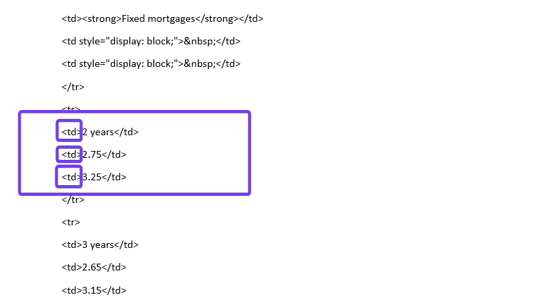

## Generali insurance
<br><br>
This repository uses three websites to show how to download the interest rates. This documentation explains how you can download the interest rates from the Generali website. 
<br><br>
Before you start setting up Generali, you must have created the Repl in Replit and a cronjob according to the [setup](0Replit_Setup.md) document.
<br><br>
The setup includes the following two steps:
1. Anlayse website
2. Creation the code in Replit

This process can also be extended to other websites of financial institutions, which are not shown here in this repository. The process is the same. 

<br><br><br><br>

In this documentation it is shown how to download the interest rates from MigrosBank.
1. Go to their [website](https://www.generali.ch/en/privatkunden/wohnen-bauen/hypotheken)
2. Scroll down to the interest rate table, open the table & analyse the figures
3. Click on the three dots in the upper right corner and go to **Settigs**
<br><br>


<br><br><br><br>

A new browser tab has now opened. Go to **Privacy and security** and select **Site settings**.
<br><br>


<br><br><br><br>

<br><br><br><br>

Now click on **JavaScript** and choose to disable JavaScript. 
<br><br>

<br><br>
There are websites that are set up with JavaScipt, these are dynamic. We cannot download with our approach (Replit & python) the data from such pages. Therefore, by deactivating JavaScript, we now check whether the website was set up in this way.
<br><br><br><br>


Go now back to your Generali webpage and **relaod** the page. Now you see that the table with the interest can no longer be retrieved. It may therefore be that we cannot download the data with our approach. 
<br><br>
**Now activate JavaScript again under settings.** 
<br><br>
To further analyse the Generali page do the following:
1. After activating the JavaScript again - relaod the page
2. Scroll down to the interest rates - open the table
3. Make a right click on the table and select **inspect**
<br><br>

<br><br><br><br>

You are now in the *Developer Tools* environment. In the *Elements* section you can now see how the website is structured, there you can also see, for example, which part of the code displays which interest rate figure. In our our case we will now focus on the 2 year term with the interest rate of **2.75%** (1st mortgage in % per annum).

1. Select the line which marks the whole table.
2. Right-click on it.
3. Select **Copy** and **Copy outerHtml**.
4. Open a new Word document.
6. Enter the copied code.
<br><br>


<br><br><br><br>

We now analyse the code in this Word file. Scroll down the Word file to the part where the code shows the interest rates. We will analyse the 2 year term (it doesn't matter which term is analysed - the structure is the same for all terms). 
<br><br>
The code is as follows for the 2 year interest rates:
```
<td>2 years</td>
<td>2.75</td>
<td>3.25</td>
```
<br><br>
When we analyse the code here, the marked letters are important, we will then incorporate them into our code. 
<br><br>


<br><br><br><br>

With this information we can now write our code. We write the code in the *financialinstitution.json* file that we have created in our Repl. 
<br><br>
The structure of the code is as follows:
```
[
    {
        "name": "xxxx",
        "url": "xxxx",
        "selectors": {
            "2 Jahre": "td:-soup-contains('2 years') + xxxx",
            "3 Jahre": "td:-soup-contains('3 years') + xxxx",
            "4 Jahre": "td:-soup-contains('4 years') + xxxx",
            "5 Jahre": "td:-soup-contains('5 years') + xxxx",
            "6 Jahre": "td:-soup-contains('6 years') + xxxx",
            "7 Jahre": "td:-soup-contains('7 years') + xxxx",
            "8 Jahre": "td:-soup-contains('8 years') + xxxx",
            "9 Jahre": "td:-soup-contains('9 years') + xxxx",
            "10 Jahre": "td:-soup-contains('10 years') + xxxx"
        }
    }
]
```
<br><br>
In the line of code where the interest rates are queried, we have to check the following: *"2 Jahre": "**td**:-soup-contains('**2 years**') + xxxx"*<br><br>
- The **td** has to match the letters which are in front of the year (*<**td**>2 years</td>*)
- The term listed in the parenthesis - for example ```('2 Jahre')``` has to match the wording in the table *<td>**2 Jahre**</td>*. 
<br><br>
We now need to replace the *xxxx* accordingly. After that the code should now look like this:
```
[
  {
        "name": "Generali",
        "url": "https://www.generali.ch/en/privatkunden/wohnen-bauen/hypotheken",
        "selectors": {
            "2 Jahre": "td:-soup-contains('2 years') + td",
            "3 Jahre": "td:-soup-contains('3 years') + td",
            "4 Jahre": "td:-soup-contains('4 years') + td",
            "5 Jahre": "td:-soup-contains('5 years') + td",
            "6 Jahre": "td:-soup-contains('6 years') + td",
            "7 Jahre": "td:-soup-contains('7 years') + td",
            "8 Jahre": "td:-soup-contains('8 years') + td",
            "9 Jahre": "td:-soup-contains('9 years') + td",
            "10 Jahre": "td:-soup-contains('10 years') + td"
        }
    }
  ]
```
<br>
In the line for the interest rate we have now inserted **td**, if we now want to download the 1st mortgage interest rate we have to insert **+ td** in the code. Then we get for the 2 years term the 2.75% we are looking for. In case we want to download the 2st mortgage rates, we need to download the second interest rate and we would do this with the code **+ td + td**. 
<br><br>
Open now the financialinstituins.json file in your Repl and enter the code.
<br><br>


<br><br><br><br>

Now when we have done that, we go into our **main.py** file. In this script we have the codes for the following tasks:
<br><br>
1. Automatic download of data via cronjob
2. **Manual download of the data**
3. Viewing the database
4. Creation of a csv file
5. Deleting the database

To check if our code in the json file is correct, we now download the data manually (without saving it in the database). For this we use the code **Manual download of the data** code. Sets all other codes inactive with the characters ```'''```. Execute the job by clicking **Run**.
<br><br>

<br><br>
The result is now displayed in the console. These interest rates should now match the data on the website. In this case, it has now worked. So our entries in the *financialinstitution.json* file are correct. Here it worked anyway, although the table could not be displayed without JavaScript. It can therefore be assumed that the button that opens the table is running with JavaScript. The table itself, however, is not based on JavaScript - the data is therefore available. 

<br><br><br><br>

In our *financialinstitutions.json* file we now have only one bank listed. However, this list can now be extended further, the separation of the financial institutions is simply done with a comma. 
<br><br>


<br><br><br><br>

Now that the code is running properly and the data is being retrieved automatically on a daily basis - make sure of the following:
 * That the script is **always** running. If the script is not running, nothing can be triggered via the web.
 * That only the first code (**Automatic download of data via cronjob**) is set to active.


